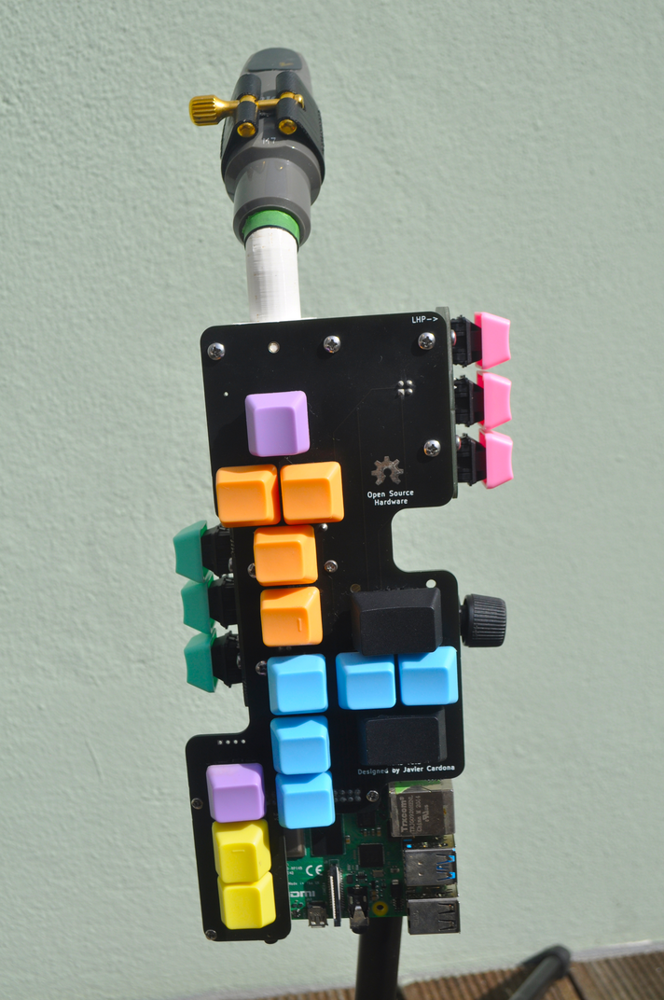
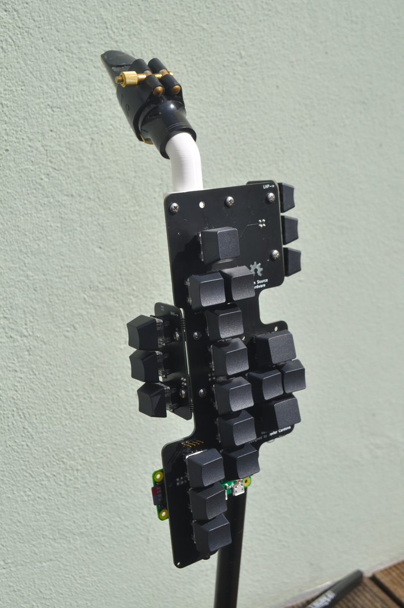
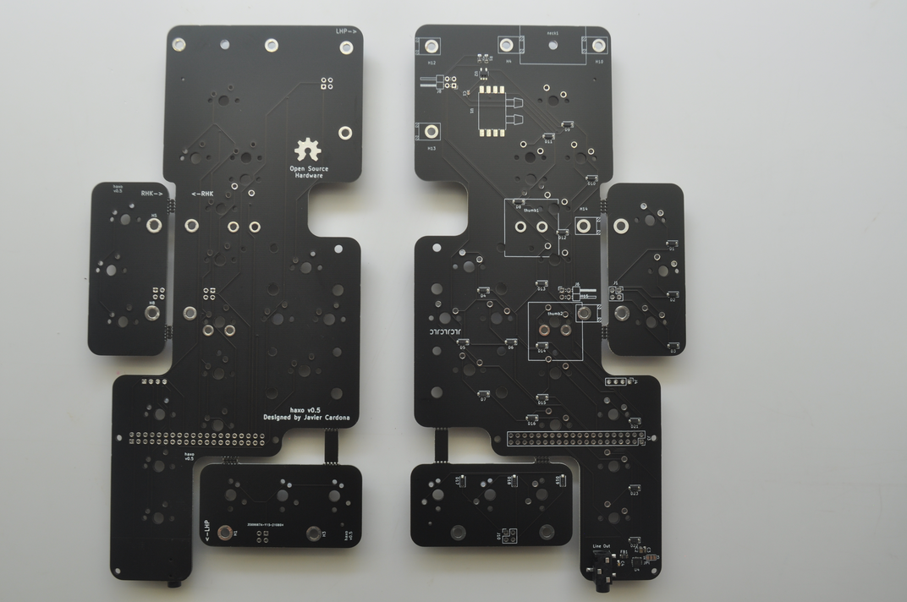

## Table of Contents 📋

<!-- toc -->

- [What is a haxophone ⁉️](#what-is-a-haxophone-%E2%81%89%EF%B8%8F)
- [Project Goals 🥅](#project-goals-%F0%9F%A5%85)
  * [Goals 🎯](#goals-%F0%9F%8E%AF)
  * [Non-Goals 💥](#non-goals-%F0%9F%92%A5)
- [How does it work? ⚙️](#how-does-it-work-%E2%9A%99%EF%B8%8F)
- [Mechanical Design 🏗](#mechanical-design-%F0%9F%8F%97)
- [Electrical Design ⚡️](#electrical-design-%E2%9A%A1%EF%B8%8F)
  * [Keyboard ⌨️](#keyboard-%E2%8C%A8%EF%B8%8F)
  * [Audio Amplifier 🔊](#audio-amplifier-%F0%9F%94%8A)
  * [Pinout 🔌](#pinout-%F0%9F%94%8C)
- [Tools/Stack 🛠](#toolsstack-%F0%9F%9B%A0)
- [Software 💾](#software-%F0%9F%92%BE)
- [Manufacturing 🏭](#manufacturing-%F0%9F%8F%AD)
- [Bill of Materials 🧾](#bill-of-materials-%F0%9F%A7%BE)
- [Assembly Instructions 🔨](#assembly-instructions-%F0%9F%94%A8)
- [TODO list ☑️](#todo-list-%E2%98%91%EF%B8%8F)
- [License and Contributions 🧱](#license-and-contributions-%F0%9F%A7%B1)
- [Acknowledgements 🙏](#acknowledgements-%F0%9F%99%8F)

<!-- tocstop -->

## What is a haxophone ⁉️

A haxophone is an electronic musical instrument that resembles a saxophone.
It is designed to be an inexpensive and fully customizable travel saxophone.
You will never get the same expressiveness or depth of sound of a real
saxophone.  But with a haxophone you should be able to play alone or with
friends wherever you might be.  The mechanical keys and unique ergonomics give
it a different kind of satisfying feel.

https://user-images.githubusercontent.com/676181/132141991-e0247b0a-3ea0-4e81-99d9-4f284d05157a.mp4

The design is fully open, software and hardware.  This means that you can make
it your own, from changing the type of key switches to making your own note and
instrument mappings.

## Project Goals 🥅

### Goals 🎯

1. Build a travel saxophone that is fun and satisfying to play.
2. Build an instrument with the same fingering as a saxophone so that muscle
   memory developed on the haxophone is directly transferrable to your main
horn.
3. Keep the cost low, below $100 USD.
4. Easy to manufacture.
5. Keep the design simple, sturdy and repairable to minimize maintenance cost.
   Using widely available and battle-tested mechanical keys from computer
keyboards is one example of this principle in use.
6. Fully hackable and customizable.

### Non-Goals 💥

1. A haxophone is not designed to be a saxophone replacement.

## How does it work? ⚙️

The haxophone is designed as a HAT (Hardware Attached on Top) for the Raspberry
Pi family of single-board computers.

The haxophone HAT is a special type of keyboard laid out in the same way as
saxophones are.  It also includes a mouthpiece and a pressure sensor to detect
breath intensity.  The HAT also includes an audio amplifier so it does not rely
on the amplifier that is built into the [Raspberry Pi
3](https://www.raspberrypi.org/products/raspberry-pi-3-model-b-plus/) and
[Raspberry Pi 4](https://www.raspberrypi.org/products/raspberry-pi-4-model-b/).
Because of that, the HAT will also work with the least expensive of the Pi's,
the [Raspberry Pi
Zero](https://www.raspberrypi.org/products/raspberry-pi-zero/).

The software that runs on the Raspberry Pi is:

1. [haxo-rs](https://github.com/jcard0na/haxo-rs):  This is the driver that
   detects key presses, breath and converts it into notes.  It's written in
   Rust, and compiled on the Raspberry Pi into a native application.
2. [fluidsynth](https://github.com/FluidSynth/fluidsynth):  This is the
   synthesizer software that will convert notes into sounds.

## Mechanical Design 🏗

In order to keep costs down, the HAT PCB (printed circuit board) is an integral
part of the physical structure of the Haxophone.  This means that key switches,
thumb rests, mouthpiece and the Raspberry Pi are all attached directly to the
PCB.  The side keys (left palm and right knuckle keys) are mounted on smaller
PCBs and attached to the main PCB via right angle metal brackets.  This smaller
PCBs are detachable pannels from the design.  This brings down the
manufacturing cost.

For improved ergonomics, a few parts are designed to be 3D printed.  These are
the mouthpiece neck, the left thumb rest, and the right thumb rest, that also
incorporates a strap hook.  The source 3D models for those parts are included
in the repository.

## Electrical Design ⚡️

The haxophone hat is comprised of three subsystems:  a keyboard, a pressure
sensor and an audio amplifier.

### Keyboard ⌨️

The keyboard is organized as a 3x8 matrix.  The diagram below shows the mapping
from saxophone keys to keyboard column/row values.

Note that due to PCB size constraints, a design decision was made to not
include a high F# key.  This key is not present in all saxophones, as that
note can be played using alternate fingerings with other keys.  The most common
mappings of the high F# are already configured on the haxophone.  If you are
used to a less common configuration, the software is easy to extend.

Also note that at the moment there matrix is not completely used:  keys (col 0,
row 7) and (col 2, row 3) are unused.

### Audio Amplifier 🔊

The haxophone HAT includes an audio amplifier and a 3.5mm mini-jack.  This
allows connecting the haxophone to headphones or to an external amplifier.

### Pinout 🔌

The diagram below shows how the HAT connects to the Raspberry Pi.  The keyboard
matrix uses discrete GPIOs, the pressure sensor uses I2C and the audio
amplifier, I2S.

You can refer to the diagram below from Raspberry Pi Spy if you need to locate
those pins on the Raspberry Pi header.

## Tools/Stack 🛠

The circuit board is designed with awesome [Kicad](https://www.kicad.org/).

All 3D models are designed with [Freecad](https://www.freecadweb.org/), the
open source 3D parametric modeler.

The code is written in [Rust](https://www.rust-lang.org) just for the pleasure
and reliability of it.

## Software 💾

See [haxo-rs](https://github.com/jcard0na/haxo-rs) for details about the software.

## Manufacturing 🏭

The circuit boards were manufactured by JLPCB, who also assembled the surface mount parts.

## Bill of Materials 🧾

The table below shows the main parts required to build a full Haxophone.  Prices are rough estimates based on purchases made for prototypes.  Shipping costs or taxes not included.

| Qty | Part Description | Manufacturer | MPN | Supplier | Estimated cost USD (at quantity 5) |
| :--- | :---        |     :---:      |          :---: |  :---: | ---: |
| 1 | Partially-assembled Haxo HAT PCB (small SMD parts populated) | N/A | N/A | Several  | $15 |
| 1 | Differential pressure SMD sensor | NXP | MPXV7007DP | Arrow |  $10     |
| 1 | Set of 3D printed parts | N/A | N/A | Several  | $4 |
| 1 | 30cm Food grade Silicon Tube ID:3mm/OD:6mm | JUNZHIDA | N/A | Amazon | $2 |
| 22 | Tactile-feedback 5-pin mechanical switches | Cherry MX | MX-Brown | Banggood | $11 |
| 22 | Keycaps For Mechanical Keyboards | [Many options!](https://esckeyboard.com/) |  | | $10  |
| 2 | 4-pin 0.1in Pin Header Con Right Angle | Samtec | TSW-102-25-T-D-RA | Arrow | $2 |
| 2 | 4-pin 0.1in Pin Socket Con Straight |  TE Connectivity | 215309-2 | Arrow | $2 |
| 1 | 40-pin 0.1in Pin Header Connector | TE Connectivity | 2-535542-0 |  Arrow | $2 |
| 6 | Mounting Bracket L-shape | Keystone | 612 | Mouser | $1.5 |
| 18 | 4-40 1/4 screws and nuts stainless | Keystone | 9900, 4694 | Mouser | $1 |
| 4 | M2/7mm machine screws cone head stainless | Master-Carr | 92010A003 | $0.5 |
| 3 | 7/16in aluminum spacers | Fascomp | FC1636-440-A | Mouser | $1 |
| 1 | Sax Mouthpiece + Reed | N/A | N/A | N/A | Bring your own (but optional) |
| 1 | Neck Strap | N/A | N/A | N/A | Bring your own (but optional) |
| 1 | Raspberry Pi Zero | Broadcom | Raspberry Pi Zero | Many | $5 |
| 1 | 16 GB SD Card | Many | N/A | Many | $6 |
| **Total** | | | | | **$73** |

## Assembly Instructions 🔨  

See [Assembly Guide](docs/assembly.md)

## TODO list ☑️

If you would like to help claim one of [the open issues](https://github.com/jcard0na/haxo-hw/issues) or [create a new one](https://github.com/jcard0na/haxo-hw/issues/new/choose) for yourself.
If you prefere to stay in software land, head out to [the software issues](https://github.com/jcard0na/haxo-rs/issues).

## License and Contributions 🧱

See [License](License).
We'll gladly accept contributions via Pull Requests.  Contributions are
accepted under the same [License](License) of the project, as captured in
[github's terms of
service](https://docs.github.com/en/github/site-policy/github-terms-of-service#6-contributions-under-repository-license).

If you plan to contribute a major feature or improvement, consider posting your proposed design as an issue before implementing it.

## Acknowledgements 🙏

[Ben Gonzales](https://gonzos.net/projects) has been a great source of inspiration and encouragement.  His [midi-Sax](https://gonzos.net/projects/midi-wind-controller-building-my-own/) is a great project worth checking out.
