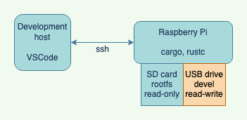

## What is a haxophone?

A haxophone is an electronic musical instrument that resembles a saxophone.   
It is designed to be an inexpensive and fully customizable travel saxophone.
You will never get the same expressiveness or depth of sound of a real
saxophone.  But with a haxophone you should be able to play alone or with
friends wherever you might be.  The mechanical keys and unique ergonomics give
it a different kind of satisfying feel.

The design is fully open, software and hardware.  This means that you can make
it your own, from changing the type of key switches to making your own note and
instrument mappings.

## Project Goals

1. Build a travel saxophone that is fun and satisfying to play.
2. Build an instrument with the same fingering as a saxophone so that muscle
   memory developed on the haxophone is directly transferrable to your main
horn.
3. Keep the cost low, below $100 USD.
4. Easy to manufacture.
5. Keep the design simple, sturdy and repairable to minimize maintenance cost.
   Using widely available and battle-tested mechanical keys from computer
keyboards is on example of this principle in use.
6. Fully hackable and customizable. 

## Non-Goals

1. A haxophone will never be a saxophone replacement.  A travel instrument, a
   fun jam horn, or a starting instrument to try out playing sax. But
eventually you will want to buy a full-size brass horn.

## How does it work?

The haxophone is designed as a HAT (Hardware Attached on Top) for the Raspberry
Pi family of single-board computers.  

The haxophone HAT is a special type of keyboard laid out in the same way as
saxophones are.  It also includes a mouthpiece and a pressure sensor to detect
breath intensity.  Finally, the HAT also includes an audio amplifier so it does
not rely on the amplifier that is built into the [Raspberry
Pi 3](https://www.raspberrypi.org/products/raspberry-pi-3-model-b-plus/) and
[Raspberry Pi 4](https://www.raspberrypi.org/products/raspberry-pi-4-model-b/).  Because of
that, the HAT will also work with the least expensive of the Pi's, the
[Raspberry Pi Zero](https://www.raspberrypi.org/products/raspberry-pi-zero/).

The software that runs on the Raspberry Pi is:

1. [haxo-rs](https://github.com/jcard0na/haxo-rs):  This is the driver that
   detects key presses, breath and converts it into notes.  It's written in
   Rust, and compiled on the Raspberry Pi into a native application.
2. [fluidsynth](https://github.com/FluidSynth/fluidsynth):  This is the
   synthesizer software that will convert notes into sounds.

## Mechanical Design

In order to keep costs down, the HAT PCB (printed circuit board) is an integral
part of the physical structure of the Haxophone.  This means that key switches,
thumb rests, mouthpiece and the Raspberry Pi are all attached directly to the
PCB.  The side keys (left palm and right knuckle keys) are mounted on smaller
PCBs and attached to the main PCB via right angle metal brackets.  This smaller
PCBs are detachable pannels from the design.  This brings down the
manufacturing cost.

For improved ergonomics, a few parts are designed to be 3D printed.  These are
the mouthpiece neck, the left thumb rest, and the right thumb rest, that also
incorporates a strap hook.  The source 3D models for those parts are included
in the repository.

## Tools/Stack

The circuit board is designed with awesome [Kicad](https://www.kicad.org/).

All 3D models are designed with [Freecad](https://www.freecadweb.org/), the
open source 3D parametric modeler.

The code is written in [Rust](https://www.rust-lang.org) just for the pleasure
and reliability of it.

## Software Development Setup

Software is developed on a headless (i.e. no display) Raspberry Pi.  The
development host runs VSCode and connects to the headless Pi over ssh.  For
reliability, we keep the root file system as read-only on the SD card.  The
development takes place on a writable USB drive.

An alternative setup could be to go full native on the Raspberry Pi, running
your IDE there.

## Manufacturing

The circuit boards were manufactured by JLPCB, who also assembled the surface mount parts.

## Bill of Materials

TBD

## Acknowledgements

[Ben Gonzales](https://gonzos.net/projects) has been a great source of inspiration and encouragement.  His [midi-Sax](https://gonzos.net/projects/midi-wind-controller-building-my-own/) is a great project worth checking out.
