# Assembly Instructions

## Requirements

To assemble a haxophone you will need the following parts:

* 1x partially assembled PCB, with the surface mount parts populated
* 1x Surface mount pressure sensor
* 1x 40-positions female connector
* 2x Right-angle 4-positions male connector
* 2x Straight 4-positions female connector
* 18x 4-40 1/4 inch stainless steel screws
* 4x 4-40 nuts
* 4x M2 flat head phillips 7mm stainless steel machine screws
* 6x L-shape brackets
*. 3x 7/16in aluminum spacers
*. 30cm silicon tube ID:3mm, OD:6mm
*. 1x 3D printed neck
*. 2x 3D printed thumb rests

You will use the following tools:

* Soldering iron and solder
* Phillips screwdriver
* Side-cutting pliers

It is also convenient to have:
* Needle nose pliers
* Alcohol and Q-tips

## Conventions

The PCB side with the Open Source Hardware logo is the front.
The opposite side, with the SMD components is the back.
The 40-pos connector area is the bottom, and the area of the neck is the top.

The PCB is comprised of 3 panels.  The larger one is the main panel, the other
two are side panels.  The side panel labelled RHK, is the Right Hand Knuckle or
Right panel.  The side panel labelled LHP is the Left Hand Palm or Left panel.

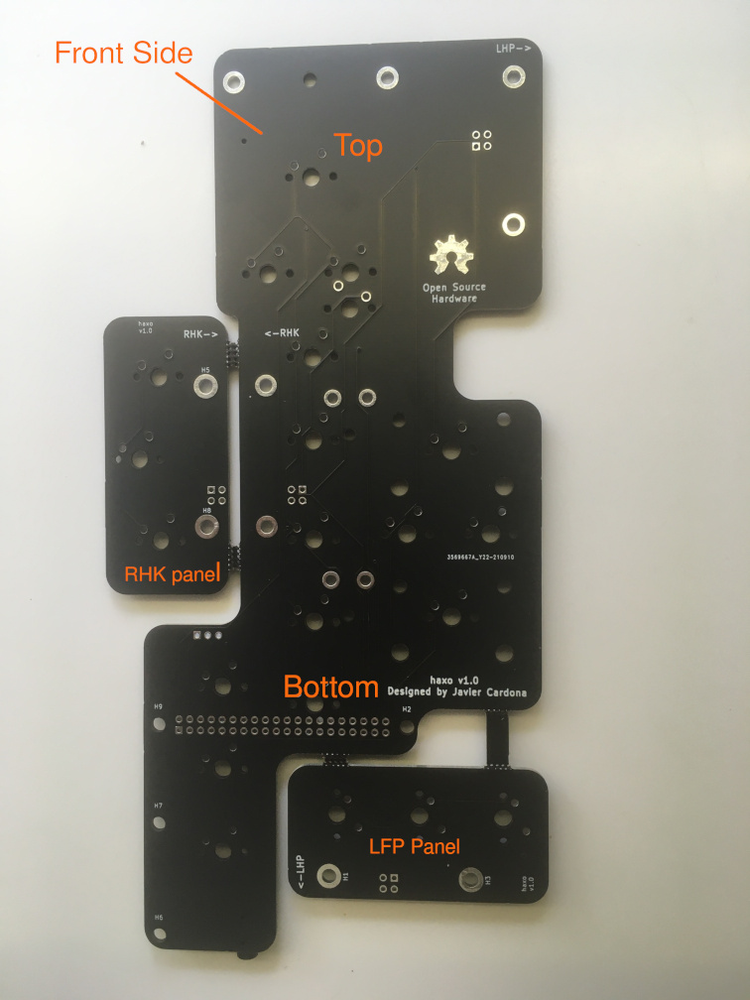

## General advice

* When soldering ensure all flux is thoroughly cleaned, as it may create leakage paths between circuit nodes.  The weak pull-up resistors of the Raspberry Pi make the keyboard matrix very sensitive to leakage paths.

## Assembly steps

### 1. Solder 40-pin connector

Solder 40-pin connector on back side

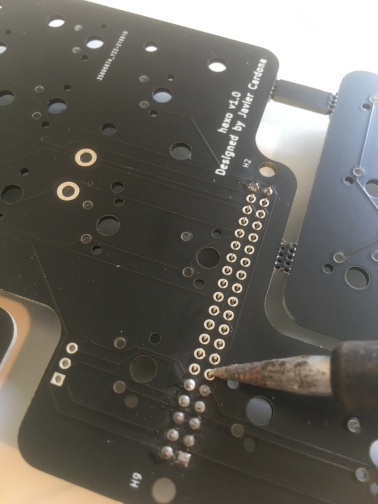

### 2. Solder keyswitches

Solder octave keyswitch, the only one on the back side, first.

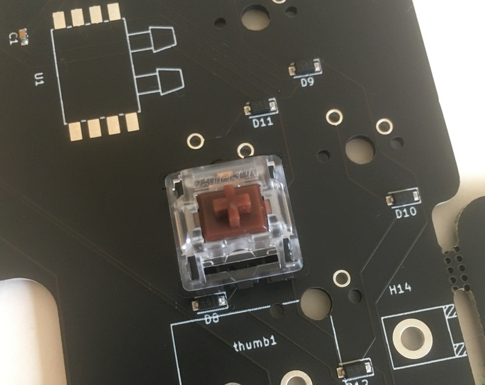

After soldering, cut the two pins protruding on the front side.  This is only
required on this switch so it does not interfere with the switch on the
opposide side.

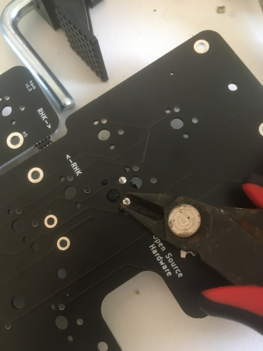

Then solder all the remaining switches.

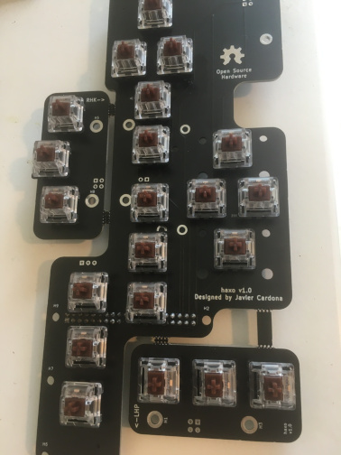

### 3. Attach thumb rests

Using M2 flat head screws, attach octave thumb rest on top, lower thumb rest
with hook on bottom.

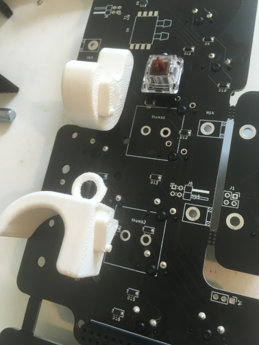

It might be easier to screw in the screws one first time without the PCB to
properly thread the plastic holes.

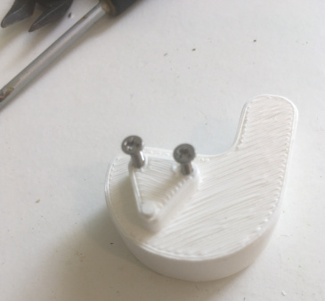

Then remove the screws, and repeat once attached to the PCB.

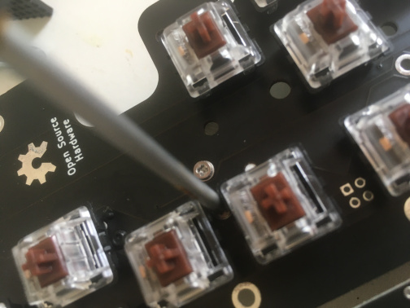

### 4. Solder pressure sensor

Solder surface mount pressure sensor.

Add solder to one pad and then solder one pin first to secure the sensor in the right position.
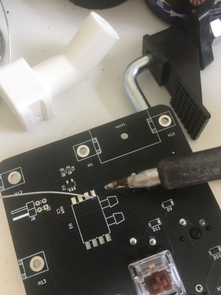
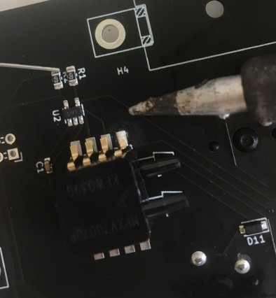

Then solder the remaining 7 pins.
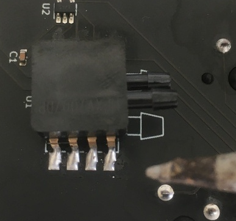

### 5. Detach PCB panels

Detach the side PCB panels by cutting along the mouse bite patterns with a cutter.

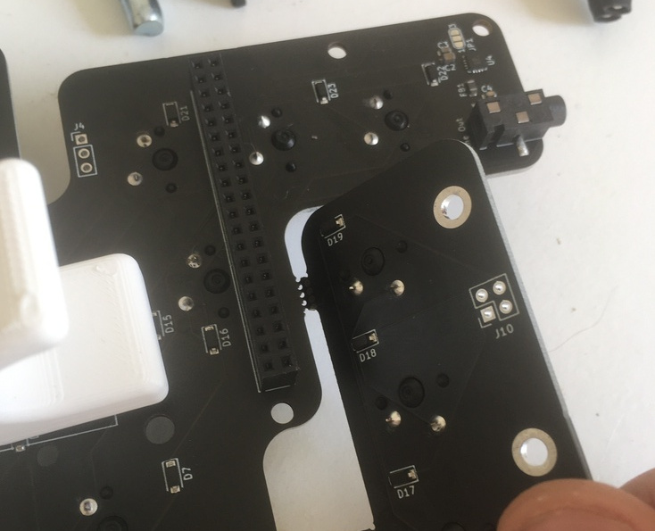
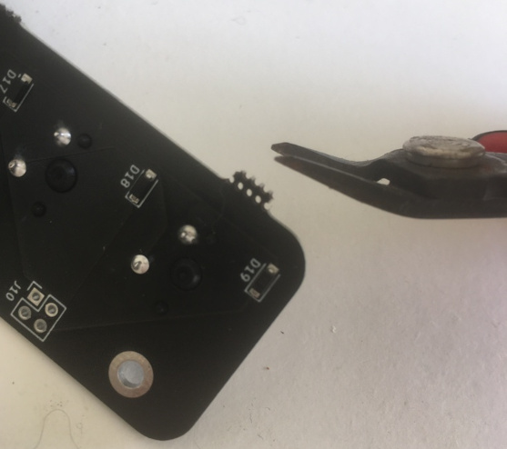

### 6. Solder right-angle 4-pos male connectors

Solder right-angle 4-pos male connectors on the bottom side of main panel.

It helps to solder one pin of the connector from the back side to fix it in
position while it is stable in place.

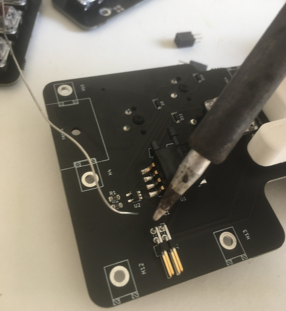

Then turn around the board and solder all four pins from the front side.

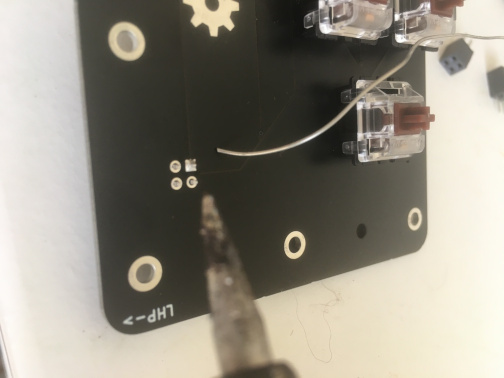

When soldering the connector for the RHK panel, be careful not to melt any of
the switches.  (If you find this challenging, [create an
issue](https://github.com/jcard0na/haxo-hw/issues/new/choose) to move this step
earlier in the assembly process :)

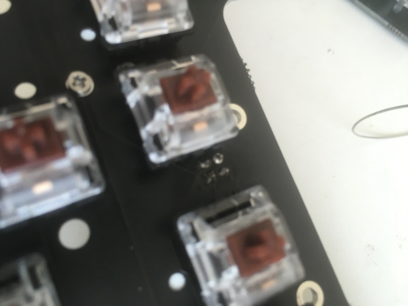

### 7. Solder straight 4-pos female connectors

Solder straight 4-pos female connectors on the bottom side of side panels.
Test that side panels can be connected to main panel.

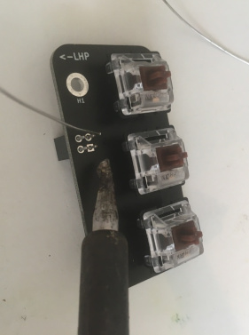
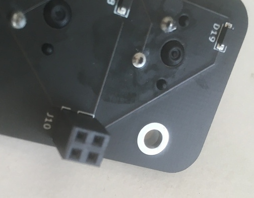

### 8. Attach side panels to main board

Attach L-brackets to side panels using screws and nuts.

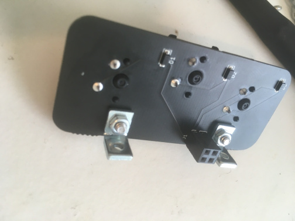

Connect side panels to main panel, and screw main panel screws.  The threaded side of all L-brackets sits on the main panel.

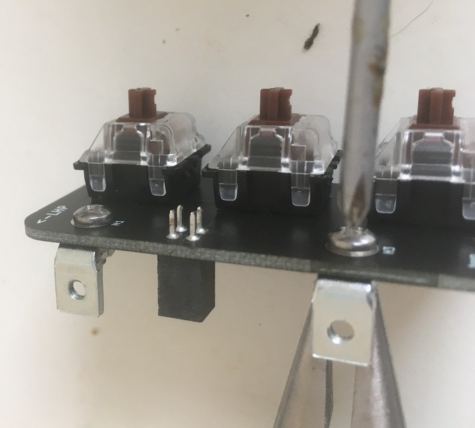
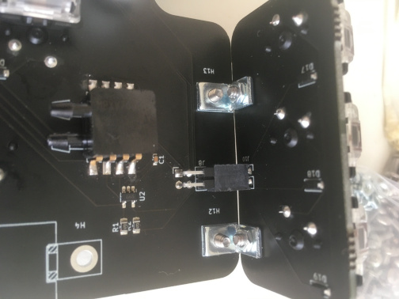

### 9. Attach neck

Attach L-brackets to both sides of neck.  The neck does not need nuts.

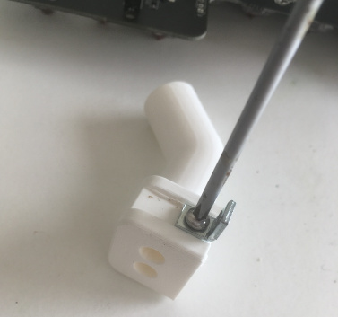
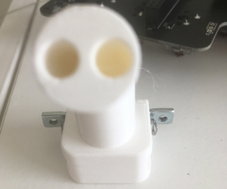

Then attach neck to main panel.

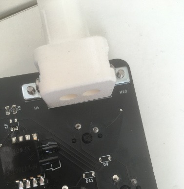

### 10. Connect pipes to neck

Use one short section (~2cm) of the pipe to connect the neck to the pressure
sensor.  Depending on your tube, you might need a bit of wire to tighten it.

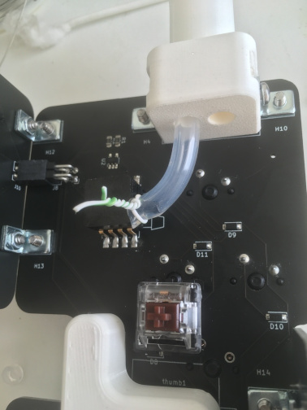

Use a longer section (~20cm) of the pipe to connect the second hole.  This
second pipe is used for venting, and has to point away from the PCB to prevent
corrosion.

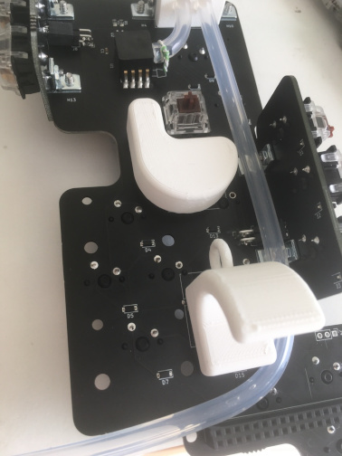

### 11. Attach Raspberry Pi

At this point the Haxophone HAT is fully assembled.  You can now attach it to a Raspberry Pi.  The Haxophone PCB has mounting holes for both Raspberry Pi sizes, the Zero and the 3/4.

Screw three spacers to the Pi:
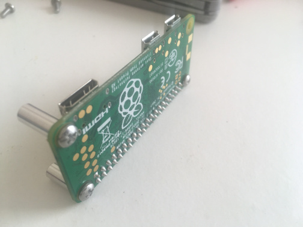

Now connect the Pi to the 40-position connector and secure it with screws.
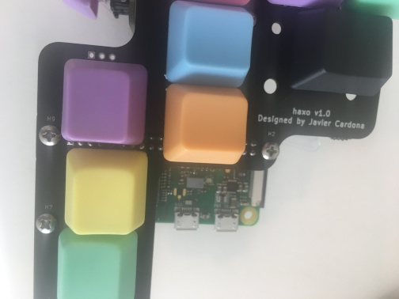

### 12. Optionally attach a mouthpiece with reed

The mouthpiece is used for embochure comfort and familiarity, but it is not really necessary.  If you use a mouthpice, you will need to also have a reed.  The reed does not produce sound, but it seals the mothpiece for a proper transfer of pressure to the sensor.

To attach a mouthpiece, you might need to use some masking, washi or cork tape to adjust the neck diameter to your mouthpiece.

### 13. Testing

In [haxo-rs](https://github.com/jcard0na/haxo-rs#testing) you will find tests that will help you verify that all keys and the pressure sensor work.

Otherwise, you can skip this step, apply power, attach headphones and start playing.
