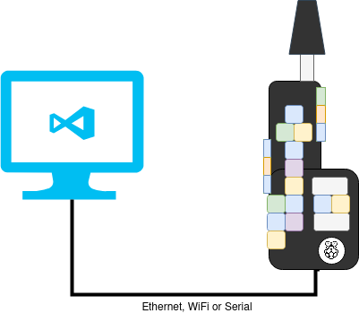

# Develpment Environment

## Contents

<!-- toc -->

- [Introduction](#introduction)
- [Setup](#setup)
- [Hardware](#hardware)
- [Initial Configuration](#initial-configuration)
- [Compilation Method 1: Native Compilation on the Raspi](#compilation-method-1-native-compilation-on-the-raspi)
- [Compilation Method 2: Cross-compilation on your computer](#compilation-method-2-cross-compilation-on-your-computer)
  * [Normal cross-compilation](#normal-cross-compilation)
  * [Cross-compilation with `cross` [BROKEN]](#cross-compilation-with-cross-broken)
- [Installation and launch](#installation-and-launch)
- [Logs](#logs)

<!-- tocstop -->

## Introduction

If you want to modify the software that runs on a Haxophone, you will need to
setup a development environment.  There are many different options on how to do
that, here I document a few different approaches I tried with different levels
of success.

## Setup

The first step is that you will need a way to connect your Raspberry Pi to your computer.



On the Raspberry Pi 3/4, this can be Wi-Fi or Ethernet.  On the Pi Zero W,
Wi-Fi.  On the Pi Zero, you will need an USB network adapter.  

If you don't have a network around, you can also use a serial console.  The
Haxophone HAT exposes the serial console signals on connector J4.  The pins
match the same pinout as pins 6,8,10 on the Raspberry Pi Header.  So, if you
had a tty serial cable that worked on the PI, it will also work on the J4
connector when the HAT is attached.  Note that the [serial console will not
work if Bluetooth is enabled on the
Raspi](https://di-marco.net/blog/it/2020-06-06-raspberry_pi_3_4_and_0_w_serial_port_usage/),
so you *probably do not want to use the serial console afterall*.

For the next sections, we will assume that you are able to get a Linux prompt
on the Raspberry Pi.  For additional help, you can refer to [Raspberry Pi
documentation](https://www.raspberrypi.com/documentation/computers/remote-access.html)

## Hardware

Highly recommended:  use a USB drive for your development and keep your SD Card
read-only most of the time.

## Initial Configuration

1. Flash [image onto Raspberry Pi](https://www.raspberrypi.com/news/raspberry-pi-imager-imaging-utility/).  For faster boot, use the Lite version of the OS (no graphical environment)
2. Pick SSH password.
3. Pick a network-unique hostname (`/etc/hostname`).
4. On raspi-config, enable: `ssh`, `I2C` and (optional) `serial console`
5. [RP Zero Only] Enable device-mode USB driver  (edit `/boot/config.txt` to add)
   ```
   [all]
   dtoverlay=dwc2
   ```
   and add `dwc2` to `/etc/modules`
6. Enable audio card (edit `/boot/config.txt` to add)
    ```
    # dtparam=audio=on
    dtoverlay=max98357a,sdmode-pin=4
    ```
7. Optionally, disable Wifi and Bluetooth.  This seems to improve performance on the RPI Zero.
   ```
   dtoverlay=disable-wifi
   dtoverlay=disable-bt
   ```
9. Speed up I2C (edit `/boot/config.txt` to add)
    ```
    dtparam=i2c_arm_baudrate=400000
    ```
10. Install project dependencies
    ```
    apt install libfluidsynth-dev git libasound2-dev i2c-tools
    ```
11. Install latest stable Rust
    ```
    curl --proto '=https' --tlsv1.2 -sSf https://sh.rustup.rs | sh
    ```

    Note: On Raspberry Pi 4 rustup might detect an incorrect architecture.  The RPi 3/4 can run in 32-bit or 64-bit.
    Check `uname -m` to see whether you are running `aarch64` or `armv7l`.  If the later, when installing rust:
    ```
    Current installation options:

    default host triple: aarch64-unknown-linux-gnu
    This is incorrect --------^^^^^^^
    ```

    To fix, pick '2. Customize installation' and set host to:
    ```
    arm-unknown-linux-gnueabihf
    ```
    See [this issue](https://github.com/rust-lang/rustup/issues/3342).
12. Automount USB drive, if attached
    ```
    sudo mkdir /media/usb
    # for FAT32 formatted drive
    echo '/dev/sda1       /media/usb        vfat    defaults,nofail,uid=1000,gid=1000        0 2' >> /etc/fstab
    # for Linux formatted drive
    echo '/dev/sda1       /media/usb        ext4    defaults,nofail        0 2' >> /etc/fstab         
    ```

    Gotcha: If you created the USB partition with e2fsck 1.47, you might encounter [this problem](https://github.com/NixOS/nixpkgs/issues/229450#issuecomment-1616324269).  Avoid it by creating your partition from Raspberry Pi (e.g. `sudo mkfs -t ext4 /dev/sda1`)

13. [If using VSCode] Connect via VSCode over ssh to target.  This will create folder `/home/pi/.vscode-server`. Move that folder to `/media/usb/`

14. [If using VSCode] Symlink `.vscode-server` directory to USB drive.
    ```
    ln -sf /media/usb/.vscode-server /home/pi
    ```
    (This is a workaround for VSCode [issue that requires a writable directory under the user's home directory](https://github.com/microsoft/vscode-remote-release/issues/472)).

15. [Highly recommended] Make SD Card read-only

    The SD Card may get corrupted if the Raspberry PI is unplugged while a
    write operation is in progress.  In normal operation, one cannot know if a
    write is happening before powering off, so a radical solution is to forbid
    all writes.  You can do this easily from `raspi-config`:

    ```
    sudo raspi-config
    Performance Options -> Overlay Filesystem -> Enable Overlay? Yes -> Make Boot Filesystem Writeable? Yes
    ```
    The overlay filesystem will make your root filesystem writable but only in
    a non-persistent way.  In other words, you may write files to, say, `/home/pi`,
    but they will disappear after a reboot.

    Reverse this steps if you need to make the filesystem writable again, for
    instance if you need to copy new versions of `haxo001` to the root fs or
    install new packages.

## Compilation Method 1: Native Compilation on the Raspi 

This works very well on a Raspberry Pi 3 and 4, but it is very slow on the Pi Zero.
If you configured the Raspberry Pi image as described in the previous section,
compilation is easy:

1. Insert a USB drive and reboot.  It should auto-mount under `/media/usb`
2. Install keys (under `/media/usb`, not the SD card) and load them
   ```
   ssh-agent bash
   ssh-add id_ed25519
   ```
3. Clone `haxo-rs` on the USB drive
    ```
    cd /media/usb
    git clone git@github.com:cardonabits/haxo-rs.git
    ```
4. If you plan to make changes to the code and submit pull requests, configure `git`
    ```
    cd haxo-rs
    git config --local user.email my@email.com
    git config --local user.name "My Name"
    git config --local core.editor vim
    ```
5. Compile
    ```
    cargo build --release
    ```
6. Only one `haxo` daemon can be running at a time.  Before running your build,
   you might need to stop the pre-installed daemon if it was launched at boot.
    ```
   systemctl stop haxo
   ```
7. Run the tests
   ```
   cargo test -- --test-threads=1
   ```

8. [Optional] Run the interactive tests
   ```
   cargo test all_keys -- --nocapture --ignored
   ```

## Compilation Method 2: Cross-compilation on your computer

With this method, we will cross-compile binaries.  This means, you will compile
on your laptop binary executables for a different architecture.  This method is
recommended if you are building images for the Pi Zero, as native compilation
is too slow.

### Normal cross-compilation

The process outlined
[here](https://chacin.dev/blog/cross-compiling-rust-for-the-raspberry-pi/), but
I mostly develop on the Pi 4, so native compilation for me is preferred.

### Cross-compilation with `cross` [BROKEN]

By using a Docker container we can run this method without having to install
special packages on your system.  It will also work independently of your
Operating System.

Using [cross](https://github.com/rust-embedded/cross), build haxo-rs for target `arm-unknown-linux-gnueabihf`
You first need to create a container with `libfluidsynth` installed and add lib
path to `build.rs`.  But compilation fails due to uresolved symbols provided by
fluidsynth dependent shared libs

Also a problem: `cross` has [an issue with targetting the Pi zero](https://github.com/rust-embedded/cross/issues/426)

## Installation and launch

The `haxo` daemon is launched by systemd.  If you need to install a new version, you need to copy the binary to where systemd expects it.

1. Disable overlay (if previously enabled)
2. Copy `target/release/haxo001` to `/usr/local/bin/haxo001`
3. Install systemctl service files
    ```
    cd scripts/systemd
    sudo ./install.sh
    ```
4. Re-enable overlay

If you need to modify how systemd launches the `haxo` daemon, you will need to
edit `/etc/systemd/system/haxo.service`:

```
[Unit]
Description=haxophone
After=network.target
StartLimitIntervalSec=0

[Service]
Type=idle
Restart=always
RestartSec=1
User=root
Group=audio
WorkingDir=/usr/share/haxo
Environment=RUST_LOG=info
ExecStart=/usr/local/bin/haxo001 \
          --notemap-file /usr/share/haxo/notemap.json \
          --bank-number 66 \
          --sf2-file /usr/share/sounds/sf2/TimGM6mb.sf2

[Install]
WantedBy=multi-user.target
```

## Logs
You can inspect logs with
```
journalctl -u haxo
Oct 11 17:11:17 raspberrypi-one haxo001[641]: Synth created
Oct 11 17:11:17 raspberrypi-one haxo001[641]: Starting haxophone...
```
