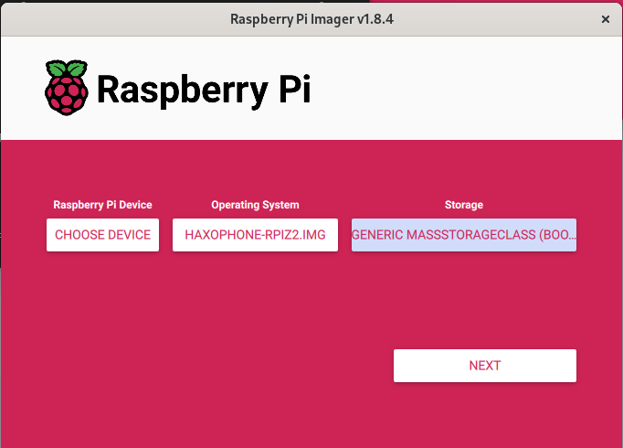
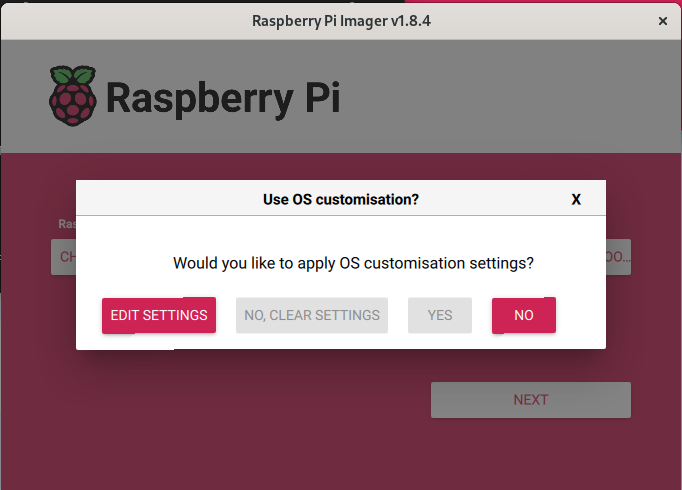
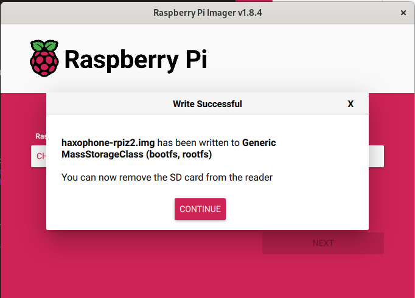

# How to copy a Haxophone image onto an SD Card

If you want the latest and greatest bleeding edge features on your haxophone, you will probably want to build [the software](https://github.com/cardonabits/haxo-rs) yourself.  But some of you just want to get up and running fast.  And for that, we have released Raspberry Pi images with the haxophone application pre-installed.

## Obtain the image

You will find those images at the links below:

* [Raspberry Pi Zero](https://bit.ly/haxo-rpiz)
* [Raspberry Pi Zero 2](https://bit.ly/haxo-rpiz2)
* [Raspberry Pi 3](https://bit.ly/haxo-rpi3)
* [Raspberry Pi 4](https://bit.ly/haxo-rpi4)

## Check the Image (Optional)

Some images (at the moment the Zero and the Zero 2) are zipped and contain a sha256 signature.  This is how you can check the integrity of the image you downloaded.

```
$ unzip haxophone-rpiz2.img.zip 
Archive:  haxophone-rpiz2.img.zip
  inflating: haxophone-rpiz2.img     
  inflating: haxophone-rpiz2.img.sha256  
$ sha256sum -c haxophone-rpiz2.img.sha256 
haxophone-rpiz2.img: OK
```

That OK means the image in your disk matches what was originally released.

## Flash the image

You can use any image flashing command to copy the image onto your SD card, from [`dd`](https://man7.org/linux/man-pages/man1/dd.1.html), to any disk utility on [Linux](https://gitlab.gnome.org/GNOME/gnome-disk-utility), [Mac](https://support.apple.com/guide/disk-utility/welcome/mac) or [Windows](https://learn.microsoft.com/en-us/windows-server/administration/windows-commands/diskpart)

The folks at Raspberry Pi have released their own SD card imaging tool that can be use for this as well.  The advantage of their tool is that it runs on all three major Operating Systems with the same UI.

To use it, first download and install Raspberry Pi Imager [from here](https://www.raspberrypi.com/software/).

Then, under `Operating System`, select `Custom Image`, then select the `.img` file you downloaded.
Click on `Choose Storage` and pick your SD Card



Say `No` to any customisations.  **This is important:  your SD Card will not boot correctly if you apply customisations** (#57)



Once complete, extract the SD Card.



If you want to troubleshoot and look at logs, take a look at [how to log into the haxophone](./login.md)
