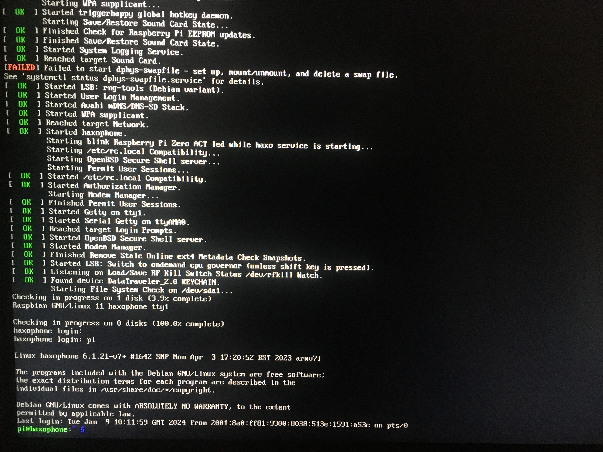

# Log into your Haxophone

Your haxophone runs on Linux, and sometimes it is necessary (or fun) to just poke inside.
For that you will need to log into your system.  There are three supported ways to do so.

## Monitor and Keyboard

This is probably the method people are most familiar with:  attach a monitor to
the HDMI port of the haxophone, a USB keyboard, and you are in.  On the Zeros,
this normally requires a micro-USB to USB adapter.  This is not the most
portable setup, as not everyone carries a monitor in their pocket.  For more
nimble solutions, keep reading.

## Serial Port

This requires a USB to 3.3V TTL adapter.  The most popular brand is
[FTDI](https://ftdichip.com/products/ttl-232r-3v3/), but there are many other
alternatives you can use.  

The Haxophone has a 3-pin header that exposes the Raspberry Pi serial port.
The pinout matches that of the Raspberry Pi header, so if you prepare a cable
for the Haxophone, you can also use it to connect directly to any Raspberry Pi.

You need to connect your cable's TxD to the Raspberry Pi RxD and your cable's
RxD to the Rasperry Pi TxD.  If you are using an FTDI cable, this is how the
colors line up.

Once you do that, you can use a serial terminal program to connect.  For instance, `minicom`.

## SSH over Ethernet

The default Haxophone images have WiFi disabled for performance.  WiFi activity
can introduce delays that affect latency while playing.  For that reason, to
connect over SSH, you would need to use Ethernet.  On the Rapsberry Pi Zero,
this means that you will need a serial to Ethernet adapter.

The haxophone images are configured with username `pi`, password `haxophone` and they will appear on your local network as `haxophone.local`.

## Conclusion

How many other instruments give you so many ways to peek inside see their internals? You should dive in! 🤿
