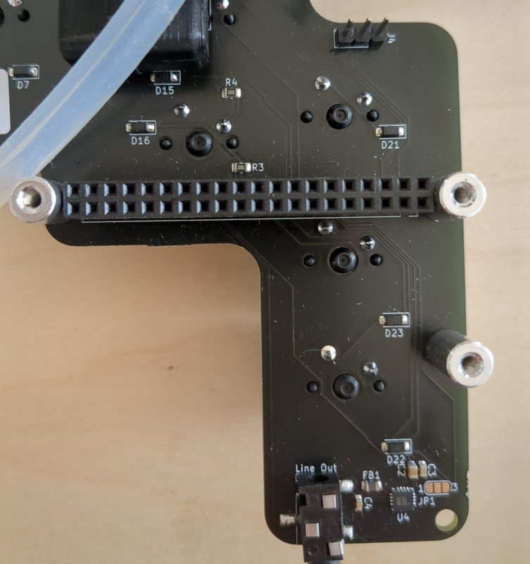

# Haxophone Manual
## Introduction
### What is the Haxophone 
The Haxophone is for you if you are a musician, a hacker or both!
It is a hackable saxophone (that's where the name comes from). It is lightweight and perfect for travelling. Enjoy the many sounds included without disturbing your neighbors! 

You can modify transposition, record the midi sound and more.

When it comes to hacking you can modify the fingering, change the default settings, add more options and much more.

You can modify everything, as it is fully open source (hardware and software).
And what is most important: You can have a lot of fun!

### Where You Can Get It
There are two ways to get a haxophone:

1. The fastest way: switch over to crowdsupply and order it there. You need to buy some more stuff as well: a Raspberry Pi Zero (or a Pi 3 or a Pi 4) and an SD card with 16 GB (see [https://www.crowdsupply.com/cardona-bits/haxophone](https://www.crowdsupply.com/cardona-bits/haxophone))

2. You can build your own! The bits and pieces needed to build the haxophone and how to assemble it can be found here: [Assembly Instructions](https://github.com/cardonabits/haxo-hw/blob/main/docs/assembly.md)

### How to Use This Manual

For the first time go to unpacking and setting up.
If you are a musician and you want to get started playing quickly: Got to section TODO
if you are a hacker-hobby-musician or a musician-hobby-hacker then go to TODO 
If you are an advanced hacker go to TODO

## Using the Haxophone
### Unpacking and Setting Up
When you receive your haxophone from crowdsupply it comes with an instrunction, some washi tape and screws.

To get started, you will need the following additional items:

1. a Raspberry Pi Zero (or TODO). This manual will assume that you have a Raspberry Pi Zero
2. A SD card with 16 GB memory and an SD card reader
3. an USB power supply with a micro USB-C plug (TODO check)
4. and headphones
5. Optional: a saxophone mouthpiece

#### Connect and Install the Software
1. **Connect the Haxophone to Raspberry Pi:**
   Attach the haxophone to the Raspberry Pi 40-pin connector, ensuring that the USB power supply port on the Raspberry Pi faces the bottom of the haxophone, aligning with the mini-jack connector direction. 

2. **Attach a Headphone to the Haxophone**
Connect a headphone or earphone to your haxophone using the mini-jack on the bottom edge

3. **Optional: Attach a Saxophone Mouthpiece:**
   If you want you can attach a saxophone mouthpiece to the haxophone's neck. Use masking, electrical or washi tape to adjust the neck's thickness to match your mouthpiece.

4. **Optional: Attach a Neck Strap:**
You can attach a neck strap just over the thumb rest.

5. **Install the Software on the SD Card**
   Download pre-compiled software image from the link below:

* Raspberry Pi Zero and Zero W: [https://bit.ly/haxo-rpiz](https://bit.ly/haxo-rpiz)
* Raspberry Pi 4: [https://bit.ly/haxo-rpi4](https://bit.ly/haxo-rpi4)
* Raspberry Pi 3: [https://bit.ly/haxo-rpi3](https://bit.ly/haxo-rpi3)
   
2. Download Raspberry Pi Imager from here:
[https://www.raspberrypi.com/software/](https://www.raspberrypi.com/software/)
3. Use Raspberry Pi Imager software to copy the
software image onto a 16 GB SD Card
4. Insert card into SD card slot of Raspberry Pi.
   

#### Start the Haxophone
1. **Connect Power**
To power up you haxophone insert the USB connector into the USB power port on the Raspberry Pi. Please take care to use the correct one marked with **PWR IN** 

Now your haxophone is ready to play!

2. **Waiting for Boot:**
   Allow the haxophone a minute to complete the boot process. You will hear a confirming sound in your headphones

3. **Start Playing:**
   Blow air through the mouthpiece to begin playing.

4. **Stop Playing:**
When you have finished playing and want to power off the haxophone, just remove the USB power. As the SD card is used in readonly mode, there is no danger in corrupting the data on the SD card when removing power.

### Before You Play

### Playing

### Howto Use the xy Functionality

### Hacking

### Advanced Hacking

## Appendix

### Haxophone Cheat Sheet

### Troubleshooting / FAQ
1. Which Raspberry Pi should I use? Pi Zero: usb 2 midi .... TODO others: more power if you want to build the image yourself...
2. Which mouthpiece should I use? The neck is 16mm in diameter, which works with some alto mouthpieces and all tenor mouthpieces, if you add a bit of washi tape for a snug fit. Do not buy an expensive mouthpiece! In contrast to a real saxophone, the mouthpiece you choose will have no effect on sound quality on the haxophone. If you have a specific mouthpiece you want to use that does not fit, you can always modify and print [another neck](https://github.com/cardonabits/haxo-hw/blob/main/models/neck-neck.stl)!

### Caring for the Haxophone
1. **Vent Tubes Cleaning:**
   Regularly clear the vent tubes on the haxophone by blowing dry air through them or using appropriately sized pipe cleaners.

2. **Surface Moisture Removal:**
   Use a dry cloth to wipe off any moisture that accumulates on the surface of the haxophone.

### Safety Information

1. **Proper Power Supply Connection:**
   ALWAYS power up the haxophone by connecting a USB-compliant power supply to the Raspberry Pi USB power port. DO NOT apply voltage in any other way.

2. **Mouth Insertion Warning:**
   DO NOT insert any part of the haxophone into your mouth except the tip of the neck or the mouthpiece, if you are using one.

3. **Device Condition Alert:**
   If the haxophone shows any signs of damage, emits acrid smells, or exhibits mold growth, STOP USING the device immediately for safety reasons.

| Document Version | Changes |
| --- | --- |
| 0.1 |     |