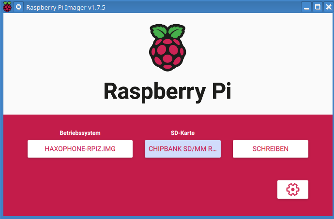
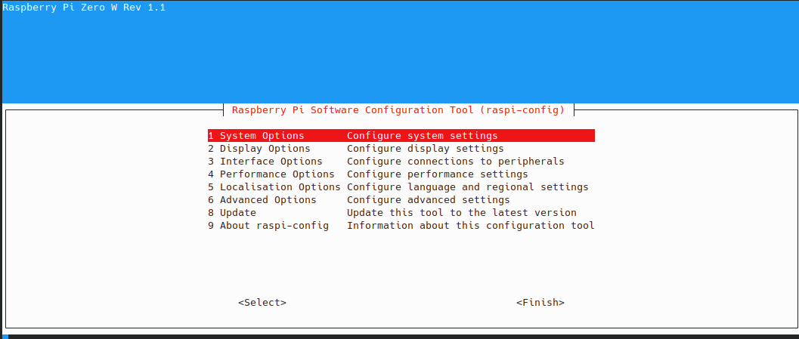
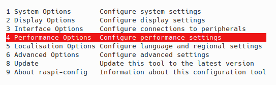
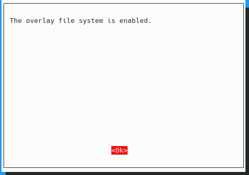
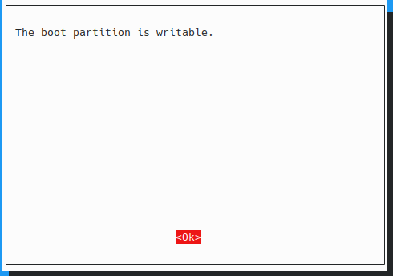
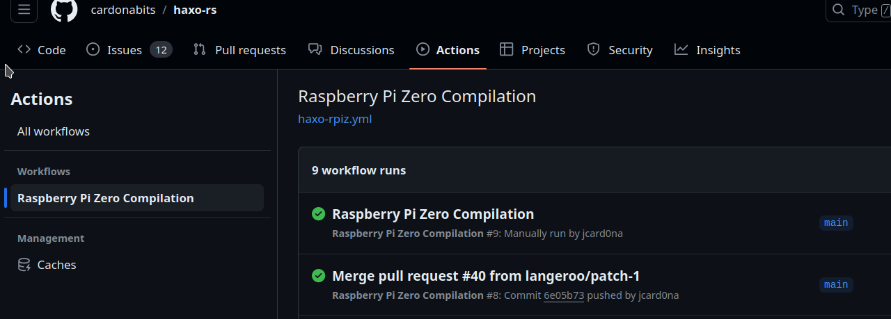

# Haxophone Manual
## Table of Contents
<!-- toc -->
- [Introduction](#introduction)
	* [What is the Haxophone ](#what-is-the-haxophone)
	* [Where You Can Get It](#where-you-can-get-a-haxophone)
	* [How to Use This Manual](#howto-use-this-manual)
- [Using the Haxophone](#using-the-haxophone)
	* [Unpacking and Setting Up](#unpackung-and-setting-up)
		+ [Connect and Install the Software](#connect-and-install-software)
		+ [Start the Haxophone](#start-haxophone)
	* [Before You Play](#before-you-play)
		+ [Choose a Sound](#choose-sound)
		+ [ Choose the Transpose Key](#choose-transpose-key)
	* [Playing](#playing)
	* [Hacking](#hacking)
		+ [Howto Connect to the Haxophone](#howto-connect)
		+ [Howto Login ](#howto-login)
		+ [Howto Make Permanent Modifications](#howto-permanent-modifications)
		+ [The File haxo.service Explained](#haxo.service-explained)
	* [Advanced Hacking](#advanced-hacking)
		+ [Install the Newest Binary](#install-newest-binary)
		+ [Howto Change the Sound Set](#howto-change-sound-set)
		+ [Howto Change the notemap.json](#howto-notemap.json)
- [Appendix](#appendix)
	* [Haxophone Cheat Sheet](#haxophone-cheat-sheet)
	* [Haxophone Sounds](#haxophone-sounds)
	* [Troubleshooting / FAQ](#troubleshooting-faq)
	* [Links and Resources](#links-and-resources)
	* [Caring for the Haxophone](#caring-for-the-haxophone)
	* [Safety Information](#safety-information)

<!-- tocstop -->

 <a name="introduction"></a>

## Introduction

 <a name="what-is-the-haxophone"></a>

### What is the Haxophone 
The Haxophone is for you if you are a musician, a hacker or both!
It is a hackable saxophone (that's where the name comes from). It is lightweight and perfect for travelling. Enjoy the many sounds included without disturbing your neighbors! 

You can modify transposition, record the midi sound and more.

When it comes to hacking you can modify the fingering, change the default settings and add more options. You can modify everything, as it is fully open source (hardware and software).

And what is most important: You can have a lot of fun!

<a name="where-you-can-get-a-haxophone"></a>

### Where You Can Get It
There are two ways to get a haxophone:

1. The fastest way: switch over to crowdsupply and order it there. You need to buy some more stuff as well: a Raspberry Pi Zero (or a Pi 3 or a Pi 4) and an SD card with 16 GB or larger(see [https://www.crowdsupply.com/cardona-bits/haxophone](https://www.crowdsupply.com/cardona-bits/haxophone))

2. You can build your own! The bits and pieces needed to build the haxophone and how to assemble it can be found here: [Assembly Instructions](https://github.com/cardonabits/haxo-hw/blob/main/docs/assembly.md)

3. You can build your own with an assembly kit that contains most of the bits and pieces:
Those of you who want to wield your soldering irons, tweezers, voltmeters and screwdrivers, but don't necessarily want to order parts all over the universe, here's your chance to order all most of the parts as a kit. Why most? We left out the keyswitches, which is what people seem be most particular about. But everything else is there: PCBA, screws, tubing, keycaps, etc.
Before ordering, check out the [assembly instructions](https://github.com/cardonabits/haxo-hw/blob/main/docs/assembly.md) to make sure you are up to the challenge! 
You can [order the kits here](https://lightnote.cardonabits.com/products/haxophone-as-a-kit).

 <a name="howto-use-this-manual"></a>

### How to Use This Manual

If you are using your haxophone for the first time go to [Unpacking and Setting Up](#unpackung-and-setting-up).

If you are a musician and you want to get started playing quickly: Got to section [Playing](#playing).

if you are a hacker-hobby-musician or a musician-hobby-hacker then go to [Hacking](#hacking).
 
If you are an advanced hacker go to [Hacking](#hacking)

 <a name="using-the-haxophone"></a>

## Using the Haxophone
 <a name="unpackung-and-setting-up"></a>

### Unpacking and Setting Up
When you receive your haxophone from crowdsupply it comes with an instruction, some washi tape and screws.


To get started, you will need the following additional items:

1. Raspberry Pi Zero or Zero W or Pi 3 or Pi 4.
2. PC or notebook with SD card reader
3. SD card with 16 or 32 GB memory
4. USB power supply with a micro USB-B plug 
5. Headphones, earphones or active speaker
6. Optional: a saxophone mouthpiece
7. Optional: HDMI cable with HDMI mini connector (not micro)
8. Optional: USB keyboard
9. Optional: USB cable, USB network adapter or USB hub with network adapter


 <a name="connect-and-install-software"></a>

#### Connect and Install the Software
1. **Connect the Raspberry Pi with the Haxophone:**
   Put the Raspberry Pi 40-pin connector plug on the haxophone 40-pin connector port. Take care that the USB power supply port on the Raspberry Pi faces the bottom of the haxophone, aligning with the mini-jack connector direction. 


2. **Connect a Headphone to the Haxophone**
Connect a headphone, earphone or active speaker to your haxophone using the mini-jack on the bottom edge

3. **Optional: Attach a Saxophone Mouthpiece:**
   If you want you can attach a saxophone mouthpiece to the haxophone's neck. Use masking, electrical or washi tape to adjust the neck's thickness to match your mouthpiece.


4. **Optional: Attach a Neck Strap:**
You can attach a neck strap using the eyelet just on top of the thumb rest.

5. **Install the Software on the SD Card**

5a) Download the pre-compiled software image from one the following links:

* Raspberry Pi Zero and Zero W: [https://bit.ly/haxo-rpiz](https://bit.ly/haxo-rpiz)
* Raspberry Pi Zero 2: [https://bit.ly/haxo-rpiz2](https://bit.ly/haxo-rpiz2)
* Raspberry Pi 4: [https://bit.ly/haxo-rpi4](https://bit.ly/haxo-rpi4)
* Raspberry Pi 3: [https://bit.ly/haxo-rpi3](https://bit.ly/haxo-rpi3)
   
Unzip the file:
```
$ unzip haxophone.img.zip 
Archive:  haxophone.img.zip
  inflating: haxophone-rpiz.img      
  inflating: haxophone-rpiz.img.sha256  
```

You can check the integrity of the file with
```
$ cat haxophone-rpiz.img.sha256 
86c5d0280d49609a18d64c2d12d66b8480fe293a02b37d1f14569640d265e469  haxophone-rpiz.img

$ sha256sum -c haxophone-rpiz.img.sha256
(long wait)
haxophone-rpiz.img: OK
```


5b) Download the Raspberry Pi Imager software from here:
[https://www.raspberrypi.com/software/](https://www.raspberrypi.com/software/) or on Ubuntu install it with
```
sudo apt install rpi-imager
```

5c) Use the Raspberry Pi Imager software to copy the
software image onto a 16 GB or 32 GB SD Card


Select "Eigenes Image" or "own image" as an operating system. As file choose the haxophone-rpiz.img file


Next select the SD card

***Warning
	If you have more than one storage device connected to your computer, be sure to choose the correct device! You can often identify storage devices by size. If you’re unsure, disconnect other devices until you’ve identified the device you want to image. *** 


Next click on "schreiben" or "write". You don't need to add any additional information in the settings section (the cog wheel button)



Next confirm that it is really this SD card you want to write on


This is the confirmation message, when writing was successful:


If you get an error message saying your SD card is too small:
Use Pishrink  [https://github.com/Drewsif/PiShrink](https://github.com/Drewsif/PiShrink)
```
wget https://raw.githubusercontent.com/Drewsif/PiShrink/master/pishrink.sh

$ sudo ./pishrink.sh -s haxophone-rpiz.img
pishrink.sh v0.1.4
pishrink.sh: Gathering data ...
Skipping autoexpanding process...
pishrink.sh: Checking filesystem ...
rootfs: recovering journal
rootfs: 102496/278880 files (0.2% non-contiguous), 1037884/1137364 blocks
resize2fs 1.47.0 (5-Feb-2023)
pishrink.sh: Shrinking filesystem ...
resize2fs 1.47.0 (5-Feb-2023)
Resizing the filesystem on /dev/loop30 to 1135693 (4k) blocks.
The filesystem on /dev/loop30 is now 1135693 (4k) blocks long.

pishrink.sh: Shrinking image ...
pishrink.sh: Shrunk haxophone-rpiz.img from 15G to 4.6G ...
```
With the shrunken image repeat the steps with the RaspBerry Pi Imager software as described above.

5d) Insert the SD card into the SD card slot of Raspberry Pi.
   


 <a name="start-haxophone"></a>

#### Start the Haxophone
1. **Connect Power:**
To power up your haxophone insert the USB connector into the USB power port on the Raspberry Pi. Please take care to use the correct one marked with **PWR IN** 


Now your haxophone is ready to play!


2. **Waiting for Boot:**
   Allow the haxophone a minute to complete the boot process. You will hear the haxophone startup tune if you have your headphones connected

3. **Start Playing:**
   Blow air through the mouthpiece or tip of the neck to begin playing.

4. **Stop Playing:**
When you have finished playing and want to power off the haxophone, just remove the USB power. As the SD card is used in readonly mode, there is no danger in corrupting the data on the SD card when removing power.

 <a name="before-you-play"></a>

### Before You Play
With the haxophone you have the full choice of what kind of instrument you want to play, you do not need to stick to the tenor saxophone sound or the fact that the keys are transposed to Bb.

So before you start playing you can choose a different sound and choose another transpose key:

<a name="choose-sound"></a>

#### Choose a Sound
The haxophone uses a tenor sax sound as the default sound. If you want to change the sound you can switch into command mode and then scroll through the sounds until you find the sound you like. Then you exit the command mode.

Here is how it works:

* to enter the command mode play a low Bb and draw air until you hear a confirmation sound
  


* when you scroll through the sounds a short sound is played with each sound
* to scroll up or down through the sounds use the up and down keys
  


* to scroll faster, press the L2 key with the up or down keys:  this will advance 10 sounds at a time


* when satisfied with the selected sound, press all three palm keys until you hear a confirmation sound
  


Now you are ready to play with the new sound!

More information is found here:

* The list of existing sounds is described in appendix [Haxophone Sounds](#haxophone-sounds)
* The cheatsheet shows the keys for using the command mode:  [Haxophone Cheat Sheet](#haxophone-cheat-sheet)

<a name="choose-transpose-key"></a>

#### Choose the Transpose Key
Note: The transpose mode feature is actually not included in the default software image. You have to install the newest version of the haxophone software. More about this in another chapter, but the work there is still in progress.

The haxophone transposes the keys to Bb by default. 
If you want to change this then you can switch into transpose mode and then play the key you want to transpose to. Then you exit the transpose mode.

Here is how it works:

* to enter the transpose mode play a low B and draw air until you hear a confirmation sound 
* next play the key you want to transpose to, so the key that will be the new C. And at the same time blow air. The new key will be played as confirmation. For example:
	+ play Eb for an alto sax
	+ play high C for a flute
	+ play Bb for a tenor sax
* when satisfied with the transpose key, press all three palm keys until you hear a confirmation sound

Now you are ready to play with the new transposed keys!

More information is found here:

* The cheatsheet shows the keys for using the transpose mode:  [Haxophone Cheat Sheet](#haxophone-cheat-sheet)


 <a name="playing"></a>

### Playing
TODO Work in Progress....
Links to fingering charts and the haxophone fingering chart

<a name="hacking"></a>

### Hacking

 <a name="howto-connect"></a>

#### Howto Connect to the Haxophone
There are several ways to connect to the haxophone. The easiest way is to use SSH over ethernet.

##### SSH over Ethernet
The easiest way to connect is to use SSH over ethernet (connecting via WiFi is possible, but the default Haxophone images have WiFi disabled for performance. WiFi activity can introduce delays that affect latency while playing). 
To connect the Rapsberry Pi Zero you need an USB to ethernet adapter as shown in the following picture: the white cable connects to the power supply, the black connects to a micro USB-B to USB A adapter and then to a USB ethernet adapter.


<a name="howto-login"></a>

#### Howto login 
Whith the haxophone connected to ethernet you should be able to login to the haxophone.
First check if the haxophone appears on your local network:
Open a command line tool or shell:

```
ping haxophone.local
```

You should get a response.

The haxophone images are configured with username pi and password haxophone. So to login to your haxophone use

```
ssh pi@haxophone.local
```
When asked for the password enter haxophone

<a name="howto-permanent-modifications"></a>

#### Howto Make Permanent Modifications
Now that you logged in successfully to your haxophone you are prepared to make your first changes.

1. Login to the haxophone as described above

<a name="disable-overlay-filesystem"></a>

2. Disable overlay file system
On the haxophone issue the following command:
```
sudo raspi-config
```
The Raspberry Pi Software Configuration Tool is started:



There you select the menu Performance Options (using the up and down keys and press enter to select):



Next you choose the menu Overlay File System:


In the next dialog you choose Enable Overlay? NO:


Then you press enter and the following confirmation message is shown:


Then again press enter and another confirmation message is shown:


Again press enter. The main menu is shown. Here you move to the finish button using the tab key:


After pressing enter the confirmation for reboot is shown:


You select the option Yes and the haxophone will reboot. The shell shows that the connection to the haxophone was closed:

```
update-initramfs: Deleting /boot/initrd.img-6.1.21+-overlay
Connection to haxophone.local closed by remote host.
Connection to haxophone.local closed.
```

2. After reboot: do the changes: (for other examples see [advanced hacking](#advanced-hacking))

As a first example we change the default instrument used by the haxophone

First step: make a copy of the original settings:
```
sudo cp /etc/systemd/system/haxo.service  /home/pi/haxo.service.backup
```

Next edit the haxo.service file:
```
sudo nano /etc/systemd/system/haxo.service
```

This shows the file using the editor nano:


Here change the part that says --prog-number 66 to  --prog-number 73 to get the flute sound after reboot instead of the default tenor sax sound:

```
ExecStart=/usr/local/bin/haxo001 \
          --notemap-file /usr/share/haxo/notemap.json \
          --prog-number 73 \
          --sf2-file /usr/share/sounds/sf2/TimGM6mb.sf2
```

Exit the nano dialog with CTRL-X and save the changes.
Now reboot the haxophone:
```
sudo reboot
```

Now the haxophone startup using the flute sound!

<a name="enable-overlay-filesystem"></a>

3. When finished: enable the overlay file system again
Start the Raspberry Pi Software Configuration Tool:

```
sudo raspi-config
```

Go again to Performance Options, then select Overlay filesystem and press enter. The following confirmation dialog is shown:


Select yes and press enter.
The generating takes some time, this is shown while generating the overlay file system:

```
update-initramfs: Generating /boot/initrd.img-6.1.21+
```

When done with generating the overlay file system, the following confirmation message is shown:



Press the enter key and proceed to the next confirmation dialog. Here we keep the default setting and root write protection with no:


Another confirmation message tells you that the boot partition is kept writable:



After that exit the configuration tool using finish. 
The haxophone will reboot.

<a name="haxo.service-explained"></a>

#### The File haxo.service explained
As a first example what we can change on the haxophone we have a look at the haxo.service file. You can find it on your haxophone in the path  /etc/systemd/system/haxo.service

Have a look at the file:

```
pi@haxophone:~ $ cat /etc/systemd/system/haxo.service 
[Unit]
Description=haxophone
After=network.target
StartLimitIntervalSec=0

[Service]
Type=idle
Restart=always
RestartSec=1
User=root
Group=audio
WorkingDir=/usr/share/haxo
Environment=RUST_LOG=info
ExecStartPre=/usr/local/bin/create_midi_gadget.sh
ExecStart=/usr/local/bin/haxo001 \
          --notemap-file /usr/share/haxo/notemap.json \
          --prog-number 66 \
          --sf2-file /usr/share/sounds/sf2/TimGM6mb.sf2 
[Install]
WantedBy=multi-user.target
```

The part that is interesting for first hacks is the following:

```
ExecStart=/usr/local/bin/haxo001 \
          --notemap-file /usr/share/haxo/notemap.json \
          --prog-number 66 \
          --sf2-file /usr/share/sounds/sf2/TimGM6mb.sf2 
```

The haxophone softeware consists of the binary haxo001 program that can be started with different options:

* **--notemap-file** here you set the path to the notemap.json file that the haxophone uses (see [Change the notemap.json](#howto-notemap.json))

* **--prog-number** with this option you select the default instrument that is played when the haxophone is started. 66 is the default tenor sax. You can change it for example to 73 you get the flute sound. (see [list of haxophone sounds](#haxophone-sounds) and use the value of preset)

* add \ after TimGM6mb.sf2 and  **--transpose 8** in a new line to change the default transposition offset for a flute (Remark: for transpose to work you need to install the newest binary)


 <a name="advanced-hacking"></a>

### Advanced Hacking

 <a name="install-newest-binary"></a>

#### Install the Newest Binary
To get the newest haxo001-rpiz.zip file do the following steps:

0. Login to github (otherwise you can not download the artifact)
1. Open [https://github.com/cardonabits/haxo-rs/actions](https://github.com/cardonabits/haxo-rs/actions)



And select the newest Raspberry Pi Zero Compilation run.

2. Download the artifact: Click on haxo001-rpiz and get the haxo001-rpiz.zip file


3. Connect via ssh and disable overlay, reboot ([see disable overlay filesystem](#disable-overlay-filesystem))
4. Unzip the file on your local pc or laptop and use scp to copy it to the haxophone:
scp haxo001 pi@haxophone.local:/home/pi/haxo001_new
5. Log in to the haxophone ([see howto login](#howto-login)) and save the original version of haxo001:
sudo cp  /usr/local/bin/haxo001 haxo001.orig
6. Then replace it with the new version:
sudo cp haxo001_new /usr/local/bin/haxo001
7. sudo reboot
8. Re-enable overlay ([see enable overlay filesystem](#enable-overlay-filesystem))

<a name="howto-change-sound-set"></a>

#### Howto Change the Sound Set
If you want to change the sound set entirely, you’ll need to:

* Install a new sound font file on the haxophone filesystem, under /usr/share/sounds/sf2/
* Modify /etc/systemd/system/haxo.service to load your new sound font instead of the one loaded by default.

<a name="howto-notemap.json"></a>

#### Howto Change the notemap.json
TODO Work in Progress....


 Modify /etc/systemd/system/haxo.service to point to your new notemap
 --notemap-file /usr/share/haxo/notemap.json \
 --notemap-file /usr/share/haxo/notemap_c_instrument.json \

 <a name="appendix"></a>

## Appendix

 <a name="haxophone-cheat-sheet"></a>

### Haxophone Cheat Sheet
Here is a cheat sheet for the haxophone ([or cheatsheet as pdf](./cheatsheet.pdf)):


This cheat sheet for the haxophone already explains the transpose mode, this feature is actually not included in the software image. You have to install the newest version of the haxophone software. More about this in another chapter, but the work there is still in progress.

 <a name="haxophone-sounds"></a>

### Haxophone Sounds

The default Haxophone image is configured to load the ubiquitous TimGM6mb.sf2 sound set developed by Tim Brechbill. The default sound set has 136 instrument sounds (presets) to choose from. As expected, the Haxophone boots into a tenor sax sound (66) by default. 

For an explanation how to switch between the sounds see 

    Piano 1 (Preset: 0, Bank: 0, Preset bag: 187)
    Standard (Preset: 0, Bank: 128, Preset bag: 18)
    Piano 2 (Preset: 1, Bank: 0, Preset bag: 186)
    Piano 3 (Preset: 2, Bank: 0, Preset bag: 184)
    Honky Tonk (Preset: 3, Bank: 0, Preset bag: 182)
    E.Piano 1 (Preset: 4, Bank: 0, Preset bag: 180)
    E.Piano 2 (Preset: 5, Bank: 0, Preset bag: 179)
    Harpsichord (Preset: 6, Bank: 0, Preset bag: 178)
    Clavinet (Preset: 7, Bank: 0, Preset bag: 177)
    Celesta (Preset: 8, Bank: 0, Preset bag: 176)
    Room (Preset: 8, Bank: 128, Preset bag: 16)
    Glockenspiel (Preset: 9, Bank: 0, Preset bag: 175)
    MusicBox (Preset: 10, Bank: 0, Preset bag: 174)
    Vibraphone (Preset: 11, Bank: 0, Preset bag: 173)
    Marimba (Preset: 12, Bank: 0, Preset bag: 172)
    Xylophone (Preset: 13, Bank: 0, Preset bag: 168)
    Tubular Bells (Preset: 14, Bank: 0, Preset bag: 167)
    Dulcimer (Preset: 15, Bank: 0, Preset bag: 165)
    Organ 1 (Preset: 16, Bank: 0, Preset bag: 164)
    Power (Preset: 16, Bank: 128, Preset bag: 13)
    Organ 2 (Preset: 17, Bank: 0, Preset bag: 163)
    Organ 3 (Preset: 18, Bank: 0, Preset bag: 161)
    Church Organ (Preset: 19, Bank: 0, Preset bag: 159)
    Reed Organ (Preset: 20, Bank: 0, Preset bag: 157)
    Accordion (Preset: 21, Bank: 0, Preset bag: 155)
    Harmonica (Preset: 22, Bank: 0, Preset bag: 154)
    Bandoneon (Preset: 23, Bank: 0, Preset bag: 152)
    Electronic (Preset: 24, Bank: 128, Preset bag: 11)
    Nylon Guitar (Preset: 24, Bank: 0, Preset bag: 151)
    Steel Guitar (Preset: 25, Bank: 0, Preset bag: 150)
    TR 808 (Preset: 25, Bank: 128, Preset bag: 8)
    Jazz Guitar (Preset: 26, Bank: 0, Preset bag: 149)
    Clean Guitar (Preset: 27, Bank: 0, Preset bag: 148)
    Guitar Mutes (Preset: 28, Bank: 0, Preset bag: 147)
    Overdrive Guitar (Preset: 29, Bank: 0, Preset bag: 145)
    DistortionGuitar (Preset: 30, Bank: 0, Preset bag: 143)
    Guitar Harmonics (Preset: 31, Bank: 0, Preset bag: 142)
    Acoustic Bass (Preset: 32, Bank: 0, Preset bag: 141)
    Jazz (Preset: 32, Bank: 128, Preset bag: 6)
    Fingered Bass (Preset: 33, Bank: 0, Preset bag: 140)
    Picked Bass (Preset: 34, Bank: 0, Preset bag: 139)
    Fretless Bass (Preset: 35, Bank: 0, Preset bag: 138)
    Slap Bass 1 (Preset: 36, Bank: 0, Preset bag: 137)
    Slap Bass 2 (Preset: 37, Bank: 0, Preset bag: 136)
    Synth Bass 1 (Preset: 38, Bank: 0, Preset bag: 135)
    Synth Bass 2 (Preset: 39, Bank: 0, Preset bag: 133)
    Brush (Preset: 40, Bank: 128, Preset bag: 4)
    Violin (Preset: 40, Bank: 0, Preset bag: 132)
    Viola (Preset: 41, Bank: 0, Preset bag: 131)
    Cello (Preset: 42, Bank: 0, Preset bag: 130)
    Contrabass (Preset: 43, Bank: 0, Preset bag: 129)
    Strings (Tremelo) (Preset: 44, Bank: 0, Preset bag: 208)
    Pizzicato (Preset: 45, Bank: 0, Preset bag: 128)
    Harp LP (Preset: 46, Bank: 0, Preset bag: 127)
    Timpani (Preset: 47, Bank: 0, Preset bag: 126)
    Orchestra (Preset: 48, Bank: 128, Preset bag: 1)
    Strings CLP (Preset: 48, Bank: 0, Preset bag: 202)
    Slow Strings LP (Preset: 49, Bank: 0, Preset bag: 197)
    Synth Strings 1 (Preset: 50, Bank: 0, Preset bag: 195)
    Synth Strings 2 (Preset: 51, Bank: 0, Preset bag: 124)
    Choir Aahs (Preset: 52, Bank: 0, Preset bag: 192)
    Voice Oohs (Preset: 53, Bank: 0, Preset bag: 122)
    Synth Vox (Preset: 54, Bank: 0, Preset bag: 121)
    Orchestra Hit (Preset: 55, Bank: 0, Preset bag: 119)
    SoloTrumpet (Preset: 56, Bank: 0, Preset bag: 118)
    Trombone (Preset: 57, Bank: 0, Preset bag: 117)
    Tuba (Preset: 58, Bank: 0, Preset bag: 116)
    Mute Trumpet (Preset: 59, Bank: 0, Preset bag: 115)
    French Horns (Preset: 60, Bank: 0, Preset bag: 107)
    Brass (Preset: 61, Bank: 0, Preset bag: 114)
    Synth Brass 1 (Preset: 62, Bank: 0, Preset bag: 112)
    Synth Brass 2 (Preset: 63, Bank: 0, Preset bag: 111)
    SopSax (TB) v2.3 (Preset: 64, Bank: 0, Preset bag: 191)
    AltoSax (TB) v2.3 (Preset: 65, Bank: 0, Preset bag: 190)
    Tenor Sax (TB) v2.3 (Preset: 66, Bank: 0, Preset bag: 189)
    BariSax (TB) v2.3 (Preset: 67, Bank: 0, Preset bag: 188)
    Oboe (Orch) (Preset: 68, Bank: 0, Preset bag: 106)
    English Horn (Preset: 69, Bank: 0, Preset bag: 105)
    Bassoon (Preset: 70, Bank: 0, Preset bag: 104)
    Clarinet (Preset: 71, Bank: 0, Preset bag: 103)
    Piccolo (Preset: 72, Bank: 0, Preset bag: 102)
    Flute TB (Preset: 73, Bank: 0, Preset bag: 0)
    Recorder (Preset: 74, Bank: 0, Preset bag: 101)
    Pan Flute (Preset: 75, Bank: 0, Preset bag: 100)
    Bottle Chiff (Preset: 76, Bank: 0, Preset bag: 98)
    Shakuhachi (Preset: 77, Bank: 0, Preset bag: 97)
    Whistle (Preset: 78, Bank: 0, Preset bag: 96)
    Ocarina (Preset: 79, Bank: 0, Preset bag: 95)
    Square Wave (Preset: 80, Bank: 0, Preset bag: 93)
    Saw Wave (Preset: 81, Bank: 0, Preset bag: 91)
    Synth Calliope (Preset: 82, Bank: 0, Preset bag: 89)
    Chiffer Lead (Preset: 83, Bank: 0, Preset bag: 87)
    Charang (Preset: 84, Bank: 0, Preset bag: 85)
    Solo Vox (Preset: 85, Bank: 0, Preset bag: 83)
    5th Saw Wave (Preset: 86, Bank: 0, Preset bag: 81)
    Bass & Lead (Preset: 87, Bank: 0, Preset bag: 79)
    Fantasia (Preset: 88, Bank: 0, Preset bag: 76)
    Warm Pad (Preset: 89, Bank: 0, Preset bag: 75)
    Poly Synth (Preset: 90, Bank: 0, Preset bag: 73)
    Space Voice (Preset: 91, Bank: 0, Preset bag: 71)
    Bowed Glass (Preset: 92, Bank: 0, Preset bag: 69)
    Metal Pad (Preset: 93, Bank: 0, Preset bag: 67)
    Halo Pad (Preset: 94, Bank: 0, Preset bag: 65)
    Sweep Pad (Preset: 95, Bank: 0, Preset bag: 63)
    IceRain (Preset: 96, Bank: 0, Preset bag: 62)
    Soundtrack (Preset: 97, Bank: 0, Preset bag: 60)
    Crystal (Preset: 98, Bank: 0, Preset bag: 58)
    Atmosphere (Preset: 99, Bank: 0, Preset bag: 56)
    Brightness (Preset: 100, Bank: 0, Preset bag: 54)
    Goblin (Preset: 101, Bank: 0, Preset bag: 52)
    Echo Drops (Preset: 102, Bank: 0, Preset bag: 50)
    Star Theme (Preset: 103, Bank: 0, Preset bag: 48)
    Sitar (Preset: 104, Bank: 0, Preset bag: 47)
    Banjo (Preset: 105, Bank: 0, Preset bag: 46)
    Shamisen (Preset: 106, Bank: 0, Preset bag: 45)
    Koto (Preset: 107, Bank: 0, Preset bag: 44)
    Kalimba (Preset: 108, Bank: 0, Preset bag: 43)
    Bagpipe (Preset: 109, Bank: 0, Preset bag: 41)
    Fiddle (Preset: 110, Bank: 0, Preset bag: 40)
    Shenai (Preset: 111, Bank: 0, Preset bag: 39)
    Tinker Bell (Preset: 112, Bank: 0, Preset bag: 38)
    Agogo (Preset: 113, Bank: 0, Preset bag: 37)
    Steel Drum (Preset: 114, Bank: 0, Preset bag: 36)
    Wood Block (Preset: 115, Bank: 0, Preset bag: 35)
    Taiko Drum (Preset: 116, Bank: 0, Preset bag: 34)
    Melodic Tom (Preset: 117, Bank: 0, Preset bag: 33)
    Synth Drum (Preset: 118, Bank: 0, Preset bag: 32)
    Reverse Cymbal (Preset: 119, Bank: 0, Preset bag: 31)
    Fret Noise (Preset: 120, Bank: 0, Preset bag: 30)
    Breath Noise (Preset: 121, Bank: 0, Preset bag: 28)
    Seashore (Preset: 122, Bank: 0, Preset bag: 27)
    Bird (Preset: 123, Bank: 0, Preset bag: 26)
    Telephone (Preset: 124, Bank: 0, Preset bag: 25)
    Helicopter (Preset: 125, Bank: 0, Preset bag: 24)
    Applause (Preset: 126, Bank: 0, Preset bag: 22)
    Gun Shot (Preset: 127, Bank: 0, Preset bag: 20)

 <a name="troubleshooting-faq"></a>

### Troubleshooting / FAQ
1. Which Raspberry Pi should I use? Pi Zero: usb 2 midi .... TODO others: more power if you want to build the image yourself...
2. Which mouthpiece should I use? The neck is 16mm in diameter, which works with some alto mouthpieces and all tenor mouthpieces, if you add a bit of washi tape for a snug fit. Do not buy an expensive mouthpiece! In contrast to a real saxophone, the mouthpiece you choose will have no effect on sound quality on the haxophone. If you have a specific mouthpiece you want to use that does not fit, you can always modify and print [another neck](https://github.com/cardonabits/haxo-hw/blob/main/models/neck-neck.stl)!

 <a name="links-and-resources"></a>

### Links and Resources
* [https://www.crowdsupply.com/cardona-bits/haxophone](https://www.crowdsupply.com/cardona-bits/haxophone)
* [https://lightnote.cardonabits.com/products/haxophone-as-a-kit](https://lightnote.cardonabits.com/products/haxophone-as-a-kit)
* [https://github.com/cardonabits/haxo-hw](https://github.com/cardonabits/haxo-hw)
* [https://github.com/cardonabits/haxo-rs](https://github.com/cardonabits/haxo-rs)
* [https://haxo-notemap.nn.r.appspot.com/](https://haxo-notemap.nn.r.appspot.com/)
* [https://www.sebulli.com/haxo/notemap/](https://www.sebulli.com/haxo/notemap/)

 <a name="caring-for-the-haxophone"></a>

### Caring for the Haxophone
1. **Vent Tubes Cleaning:**
   Regularly clear the vent tubes on the haxophone by blowing dry air through them or using appropriately sized pipe cleaners.

2. **Surface Moisture Removal:**
   Use a dry cloth to wipe off any moisture that accumulates on the surface of the haxophone.

 <a name="safety-information"></a>

### Safety Information

1. **Proper Power Supply Connection:**
   ALWAYS power up the haxophone by connecting a USB-compliant power supply to the Raspberry Pi USB power port. DO NOT apply voltage in any other way.

2. **Mouth Insertion Warning:**
   DO NOT insert any part of the haxophone into your mouth except the tip of the neck or the mouthpiece, if you are using one.

3. **Device Condition Alert:**
   If the haxophone shows any signs of damage, emits acrid smells, or exhibits mold growth, STOP USING the device immediately for safety reasons.


| Document Version | Changes |
| --- | --- |
| 0.2 |     |
