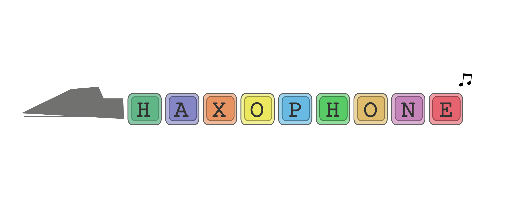

# Haxophone Manual
## Table of Contents
<!-- toc -->
- [Introduction](#introduction)
	* [What is the Haxophone ](#what-is-the-haxophone)
	* [Where You Can Get It](#where-you-can-get-a-haxophone)
	* [How to Use This Manual](#howto-use-this-manual)
- [Using the Haxophone](#using-the-haxophone)
	* [Unpacking and Setting Up](#unpackung-and-setting-up)
		+ [Connect and Install the Software](#connect-and-install-software)
		+ [Start the Haxophone](#start-haxophone)
	* [Before You Play](before-you-play)
	* [Playing](#playing)
	* [Hacking](#hacking)
- [Appendix](#appendix)
	* [Haxophone Cheat Sheet](#haxophone-cheat-sheet)
	* [Troubleshooting / FAQ](#troubleshooting-faq)
	* [Links and Resources](#links-and-resources)
	* [Caring for the Haxophone](#caring-for-the-haxophone)
	* [Safety Information](#safety-information)

<!-- tocstop -->

 <a name="introduction"></a>

## Introduction

 <a name="what-is-the-haxophone"></a>

### What is the Haxophone 
The Haxophone is for you if you are a musician, a hacker or both!
It is a hackable saxophone (that's where the name comes from). It is lightweight and perfect for travelling. Enjoy the many sounds included without disturbing your neighbors! 

You can modify transposition, record the midi sound and more.

When it comes to hacking you can modify the fingering, change the default settings and add more options. You can modify everything, as it is fully open source (hardware and software).

And what is most important: You can have a lot of fun!

<a name="where-you-can-get-a-haxophone"></a>

### Where You Can Get It
There are two ways to get a haxophone:

1. The fastest way: switch over to crowdsupply and order it there. You need to buy some more stuff as well: a Raspberry Pi Zero (or a Pi 3 or a Pi 4) and an SD card with 16 GB (see [https://www.crowdsupply.com/cardona-bits/haxophone](https://www.crowdsupply.com/cardona-bits/haxophone))

2. You can build your own! The bits and pieces needed to build the haxophone and how to assemble it can be found here: [Assembly Instructions](https://github.com/cardonabits/haxo-hw/blob/main/docs/assembly.md)

 <a name="howto-use-this-manual"></a>

### How to Use This Manual

If you are using your haxophone for the first time go to unpacking and setting up.
If you are a musician and you want to get started playing quickly: Got to section TODO
if you are a hacker-hobby-musician or a musician-hobby-hacker then go to TODO 
If you are an advanced hacker go to TODO

 <a name="using-the-haxophone"></a>

## Using the Haxophone
 <a name="unpackung-and-setting-up"></a>

### Unpacking and Setting Up
When you receive your haxophone from crowdsupply it comes with an instruction, some washi tape and screws.

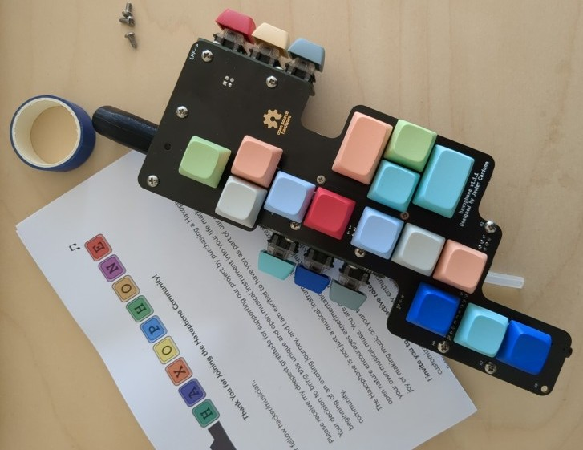

To get started, you will need the following additional items:

1. Raspberry Pi Zero or Zero W or Pi 3 or Pi 4.
2. PC or notebook with SD card reader
3. SD card with 16 or 32 GB memory
4. USB power supply with a micro USB-B plug 
5. Headphones, earphones or active speaker
6. Optional: a saxophone mouthpiece
7. Optional: HDMI cable with HDMI mini connector (not micro)
8. Optional: USB keyboard
9. Optional: USB cable, USB network adapter or USB hub with network adapter

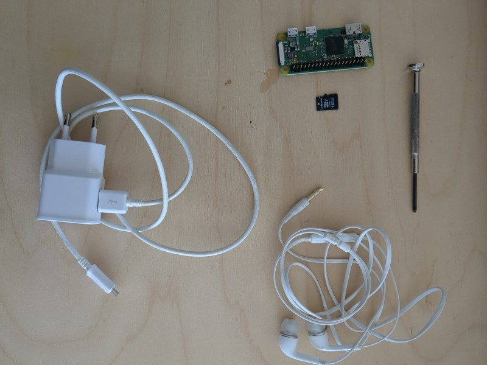

 <a name="connect-and-install-software"></a>

#### Connect and Install the Software
1. **Connect the Raspberry Pi with the Haxophone:**
   Put the Raspberry Pi 40-pin connector plug on the haxophone 40-pin connector port. Take care that the USB power supply port on the Raspberry Pi faces the bottom of the haxophone, aligning with the mini-jack connector direction. 

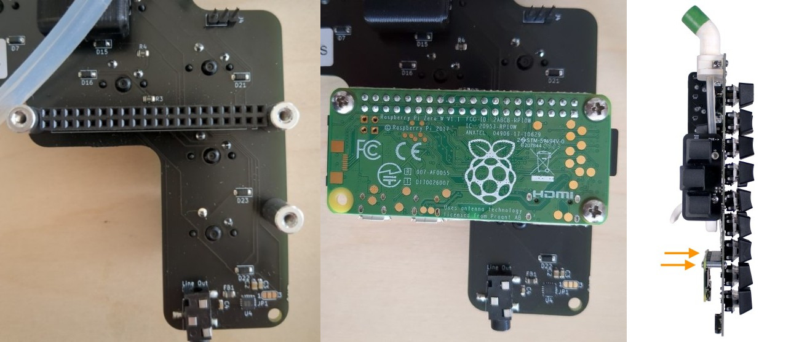

2. **Connect a Headphone to the Haxophone**
Connect a headphone, earphone or active speaker to your haxophone using the mini-jack on the bottom edge

3. **Optional: Attach a Saxophone Mouthpiece:**
   If you want you can attach a saxophone mouthpiece to the haxophone's neck. Use masking, electrical or washi tape to adjust the neck's thickness to match your mouthpiece.

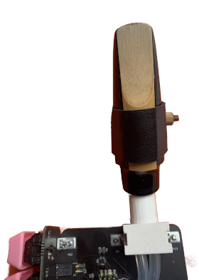

4. **Optional: Attach a Neck Strap:**
You can attach a neck strap using the eyelet just on top of the thumb rest.

5. **Install the Software on the SD Card**

5a) Download the pre-compiled software image from one the following links:

* Raspberry Pi Zero and Zero W: [https://bit.ly/haxo-rpiz](https://bit.ly/haxo-rpiz)
* Raspberry Pi 4: [https://bit.ly/haxo-rpi4](https://bit.ly/haxo-rpi4)
* Raspberry Pi 3: [https://bit.ly/haxo-rpi3](https://bit.ly/haxo-rpi3)
   
Unzip the file:
```
$ unzip haxophone.img.zip 
Archive:  haxophone.img.zip
  inflating: haxophone-rpiz.img      
  inflating: haxophone-rpiz.img.sha256  
```

You can check the integrity of the file with
```
$ cat haxophone-rpiz.img.sha256 
86c5d0280d49609a18d64c2d12d66b8480fe293a02b37d1f14569640d265e469  haxophone-rpiz.img

$ sha256sum -c haxophone-rpiz.img.sha256
(long wait)
haxophone-rpiz.img: OK
```


5b) Download the Raspberry Pi Imager software from here:
[https://www.raspberrypi.com/software/](https://www.raspberrypi.com/software/) or on Ubuntu install it with
```
sudo apt install rpi-imager
```

5c) Use the Raspberry Pi Imager software to copy the
software image onto a 16 GB SD Card

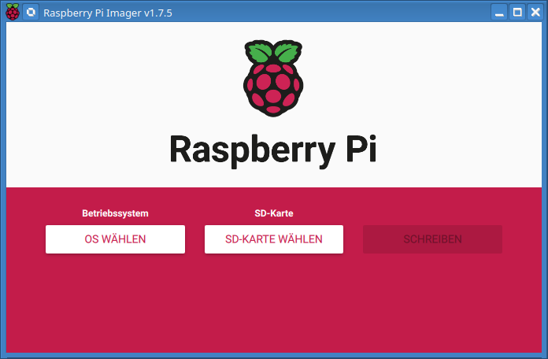

Select "Eigenes Image" or "own image" as an operating system. As file choose the haxophone-rpiz.img file

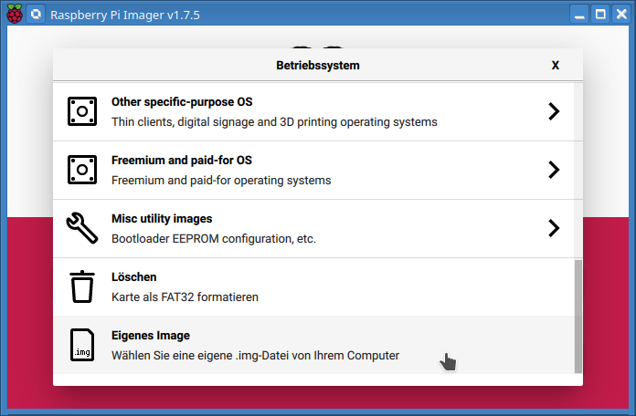

Next select the SD card

***Warning
	If you have more than one storage device connected to your computer, be sure to choose the correct device! You can often identify storage devices by size. If you’re unsure, disconnect other devices until you’ve identified the device you want to image. *** 

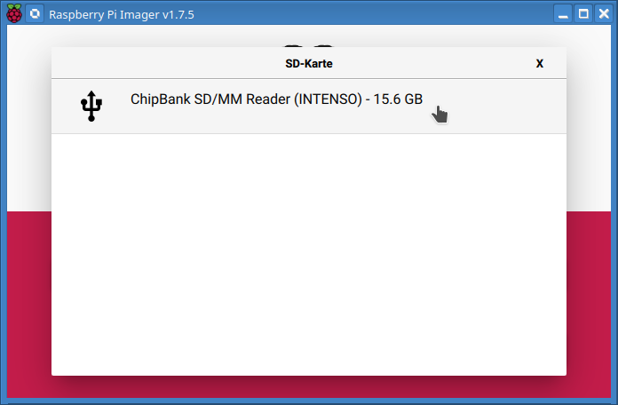

Next click on "schreiben" or "write". You don't need to add any additional information in the settings section (the cog wheel button)

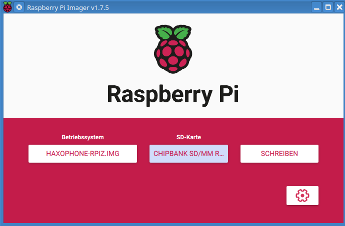

Next confirm that it is really this SD card you want to write on

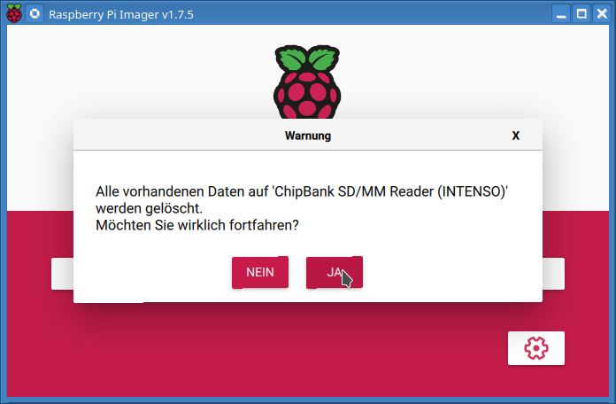

This is the confirmation message, when writing was successful:

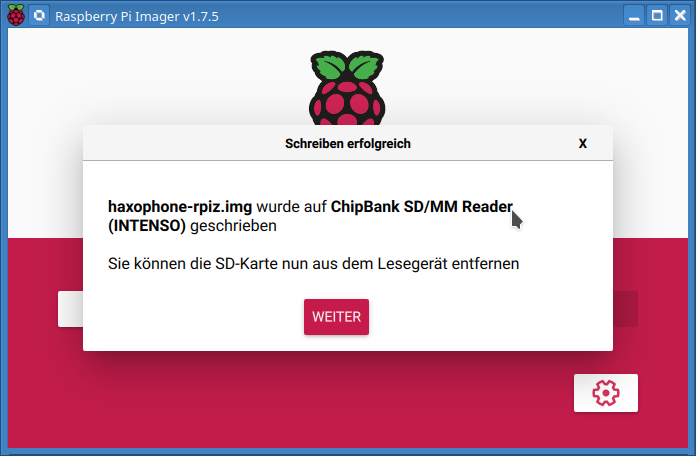

If you get an error message saying your SD card is too small:
Use Pishrink  [https://github.com/Drewsif/PiShrink](https://github.com/Drewsif/PiShrink)
```
wget https://raw.githubusercontent.com/Drewsif/PiShrink/master/pishrink.sh

$ sudo ./pishrink.sh -s haxophone-rpiz.img
pishrink.sh v0.1.4
pishrink.sh: Gathering data ...
Skipping autoexpanding process...
pishrink.sh: Checking filesystem ...
rootfs: recovering journal
rootfs: 102496/278880 files (0.2% non-contiguous), 1037884/1137364 blocks
resize2fs 1.47.0 (5-Feb-2023)
pishrink.sh: Shrinking filesystem ...
resize2fs 1.47.0 (5-Feb-2023)
Resizing the filesystem on /dev/loop30 to 1135693 (4k) blocks.
The filesystem on /dev/loop30 is now 1135693 (4k) blocks long.

pishrink.sh: Shrinking image ...
pishrink.sh: Shrunk haxophone-rpiz.img from 15G to 4.6G ...
```
With the shrunken image repeat the steps with the RaspBerry Pi Imager software as described above.

5d) Insert the SD card into the SD card slot of Raspberry Pi.
   
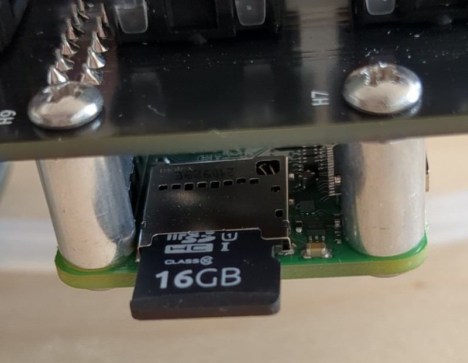

 <a name="start-haxophone"></a>

#### Start the Haxophone
1. **Connect Power:**
To power up your haxophone insert the USB connector into the USB power port on the Raspberry Pi. Please take care to use the correct one marked with **PWR IN** 

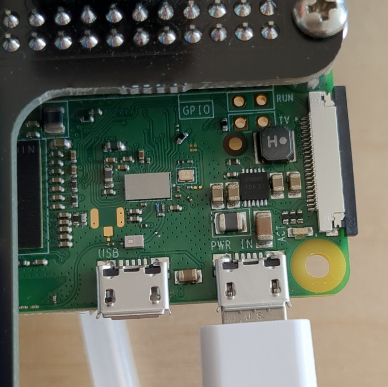

Now your haxophone is ready to play!

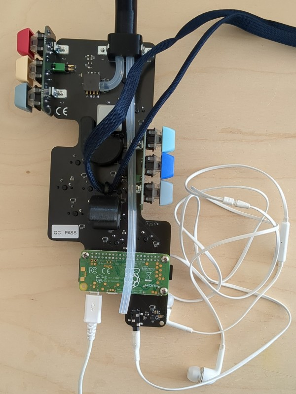


2. **Waiting for Boot:**
   Allow the haxophone a minute to complete the boot process. You will hear the haxophone startup tune if you have your headphones connected

3. **Start Playing:**
   Blow air through the mouthpiece or tip of the neck to begin playing.

4. **Stop Playing:**
When you have finished playing and want to power off the haxophone, just remove the USB power. As the SD card is used in readonly mode, there is no danger in corrupting the data on the SD card when removing power.

 <a name="before-you-play"></a>

### Before You Play
Work in Progress....

 <a name="playing"></a>

### Playing
Work in Progress....

 <a name="howto-use-xy"></a>

### Howto Use the xy Functionality
Work in Progress....

 <a name="hacking"></a>

### Hacking
Work in Progress....

 <a name="advanced-hacking"></a>

### Advanced Hacking
Work in Progress....

 <a name="appendix"></a>

## Appendix

 <a name="haxophone-cheat-sheet"></a>

### Haxophone Cheat Sheet
Here is a cheat sheet for the haxophone ([or cheatsheet as pdf](./cheatsheet.pdf)):

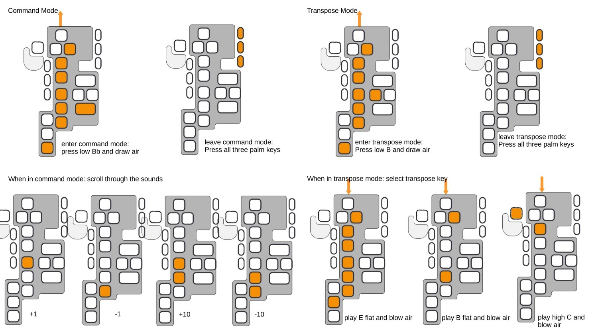

This cheat sheet for the haxophone already explains the transpose mode, this feature is actually not included in the software image. You have to install the newest version of the haxophone software. More about this in another chapter, but the work there is still in progress.

 <a name="troubleshooting-faq"></a>

### Troubleshooting / FAQ
1. Which Raspberry Pi should I use? Pi Zero: usb 2 midi .... TODO others: more power if you want to build the image yourself...
2. Which mouthpiece should I use? The neck is 16mm in diameter, which works with some alto mouthpieces and all tenor mouthpieces, if you add a bit of washi tape for a snug fit. Do not buy an expensive mouthpiece! In contrast to a real saxophone, the mouthpiece you choose will have no effect on sound quality on the haxophone. If you have a specific mouthpiece you want to use that does not fit, you can always modify and print [another neck](https://github.com/cardonabits/haxo-hw/blob/main/models/neck-neck.stl)!

 <a name="links-and-resources"></a>

### Links and Resources
* [https://www.crowdsupply.com/cardona-bits/haxophone](https://www.crowdsupply.com/cardona-bits/haxophone)
* [https://github.com/cardonabits/haxo-hw](https://github.com/cardonabits/haxo-hw)
* [https://github.com/cardonabits/haxo-rs](https://github.com/cardonabits/haxo-rs)
* [https://haxo-notemap.nn.r.appspot.com/](https://haxo-notemap.nn.r.appspot.com/)
* [https://www.sebulli.com/haxo/notemap/](https://www.sebulli.com/haxo/notemap/)

 <a name="caring-for-the-haxophone"></a>

### Caring for the Haxophone
1. **Vent Tubes Cleaning:**
   Regularly clear the vent tubes on the haxophone by blowing dry air through them or using appropriately sized pipe cleaners.

2. **Surface Moisture Removal:**
   Use a dry cloth to wipe off any moisture that accumulates on the surface of the haxophone.

 <a name="safety-information"></a>

### Safety Information

1. **Proper Power Supply Connection:**
   ALWAYS power up the haxophone by connecting a USB-compliant power supply to the Raspberry Pi USB power port. DO NOT apply voltage in any other way.

2. **Mouth Insertion Warning:**
   DO NOT insert any part of the haxophone into your mouth except the tip of the neck or the mouthpiece, if you are using one.

3. **Device Condition Alert:**
   If the haxophone shows any signs of damage, emits acrid smells, or exhibits mold growth, STOP USING the device immediately for safety reasons.


| Document Version | Changes |
| --- | --- |
| 0.1 |     |